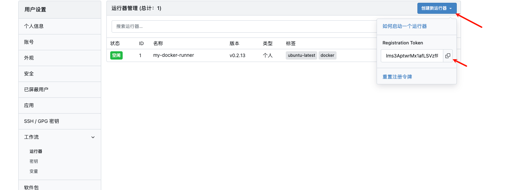
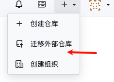
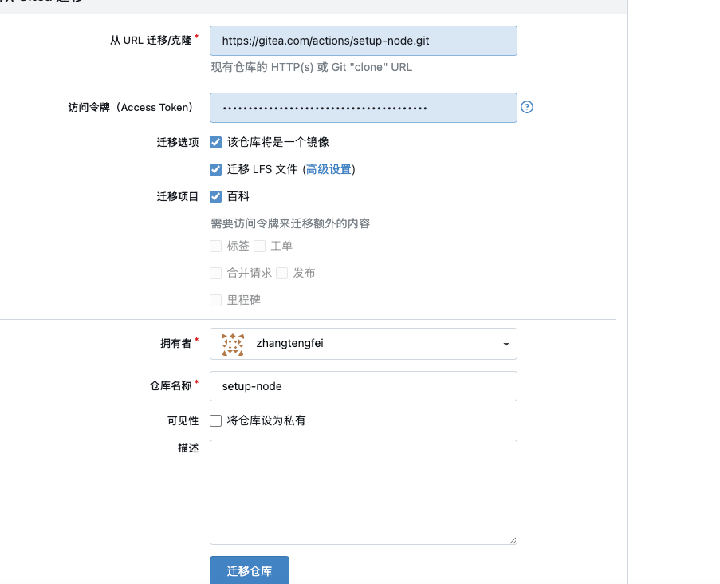

gitea 有着轻量化的 git仓库和工作流程序，满足小团队进行自动化和代码私有化部署

## docker 安装 gitea
```yml
version: "3"

networks:
  gitea:
    external: false

services:
  server:
    image: docker.gitea.com/gitea:1.25.3
    container_name: gitea
    environment:
      - USER_UID=1000
      - USER_GID=1000
    restart: always
    networks:
      - gitea
    volumes:
      - ./gitea:/data
      - /etc/timezone:/etc/timezone:ro
      - /etc/localtime:/etc/localtime:ro
    ports:
      - "9999:3000"
      - "9998:22"
```
其中9999 是 外部访问gitea 的端口，
gitea 的文件映射是存储在当前 文件夹下的 `gitea` 文件

创建完成后，可以访问 9999端口进行初始化操作

可以设置存储的数据源，有sqllit，pg，mysql ，
完成后就可以进入到git仓库页面了


## 配置工作流
要运行工作流需要单独的执行器容器，执行器和gitea 仓库是单独运行的
首先需要先去gitea 仓库设置页找到添加工作流

复制密钥

```shell
  docker run -d \
  --name=gitea-runner \
  --restart=always \
  -v /var/run/docker.sock:/var/run/docker.sock \
  -v ./act_runner_data:/data \
  -e GITEA_INSTANCE_URL=http://127.0.0.1:9999/ \
  -e GITEA_RUNNER_REGISTRATION_TOKEN=lms3AptwrMx1afLSVzfPWDAEogrkjYBAosxro2Sm \
  -e GITEA_RUNNER_NAME=my-docker-runner \
  -e GITEA_RUNNER_LABELS=ubuntu-latest,docker \
  gitea/act_runner:latest
```
其中  `GITEA_RUNNER_REGISTRATION_TOKEN` 的值就是上述图片复制的密钥
`GITEA_INSTANCE_URL` 是gitea 的访问路径


## action 插件迁移
gitea 的工作流插件是和github 使用的同一套，为了避免去github 拉取插件导致工作流卡住，我们需要迁移一些常用的action 到我们的gitea 私有仓库中
1。 首先去gitea 注册一个账号 https://gitea.com/actions

这个页面存储了官方的action 插件

我们需要去个人设置页面找到添加 应用令牌 https://gitea.com/user/settings/applications
申请一个 Access Token

然后复制一个自己需要的action 插件的 git 地址，例如 https://gitea.com/actions/checkout.git

然后在自己私有仓库，点击迁移仓库

选择从gitea 导入



点击迁移就可以 导入插件了


## 使用本地仓库的插件

```yml
name: Analyze Risk

on:
  push:
    branches:
      - '**'

jobs:
  analyze-risk:
    runs-on: ubuntu-latest
    container:
      image: node-python-env
    steps:
      - name: 检出代码
        uses: http://10.254.91.129:9999/zhangtengfei/checkout@main

      - name: 设置 Python 环境
        uses: http://10.254.91.129:9999/zhangtengfei/setup-python@main

      - name: 安装依赖
        run: |
          pip3 install -i https://pypi.tuna.tsinghua.edu.cn/simple -r requirements.txt

      - name: 执行 analyze_risk.py
        run: |
          python3 多因子/analyze_risk.py

      - name: 保存导出文件
        uses: http://10.254.91.129:9999/zhangtengfei/upload-artifact@v3
        with:
          name: 风险统计分析
          path: 多因子/

```
这里给了一个案例
需要在uses 这里的插件名称使用http/https 开头的全路径即可访问内部仓库的插件，就不会被网络卡住了


工作流文件需要存储在`.gitea/workflows/main.yml` 中

## 结尾
由于拉取的系统 没有包含常用的语言依赖，就会在每次都需要写一个apt 去安装各种依赖，浪费很多时间

可以自己构建一个镜像，使用本地镜像把常用的语言依赖 构建器都存入，
```yml
FROM node:20-bullseye

# 更换为阿里云 Debian 源，加速依赖安装
RUN sed -i 's@deb.debian.org@mirrors.aliyun.com@g' /etc/apt/sources.list && \
    apt-get update && \
    apt-get install -y python3 python3-pip && \
    rm -rf /var/lib/apt/lists/*

WORKDIR /workspace

CMD [ "bash" ]
```
构建这么一个镜像，接着在工作流中声明使用即可
```yml
container:
  image: node-python-env
```
