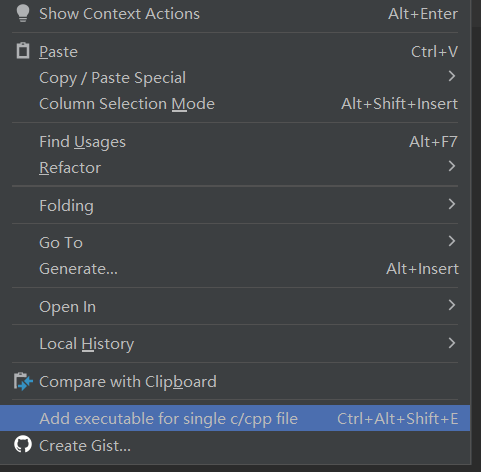
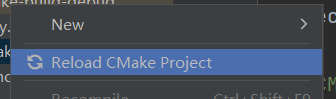

clion 是jb 家c/c++ 语言编辑器,

c 项目中只能有一个main 函数,不能像Java一样 实现单文件运行,但是可以在`CMakeLists.txt` 设置 main函数的项目名称,和运行文件,就可以实现 单文件运行

例如

```
add_executable(demo2 demo2.c)
add_executable(demo3 demo3.c)
```

这样,就可以实现 demo2 和demo3 都可以运行main 函数,但是这样从操作太繁琐,

可以安装一款插件实现自动化写入这个内容[C/C++ Single File Execution - CLion Plugin | Marketplace (jetbrains.com)](https://plugins.jetbrains.com/plugin/8352-c-c--single-file-execution)

使用方法 :

1. 首先创建一个c 文件,然后右键选择



添加完成后,再对`CMakeLists.txt` 文件右键



重新加载项目即可,再回到刚才的文件,就可以写main 函数运行了