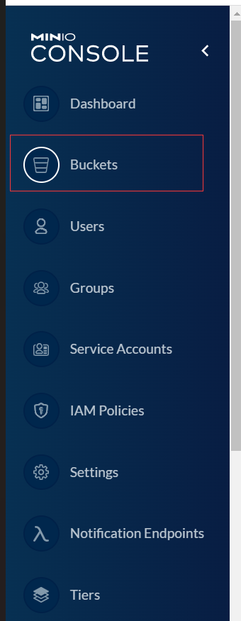
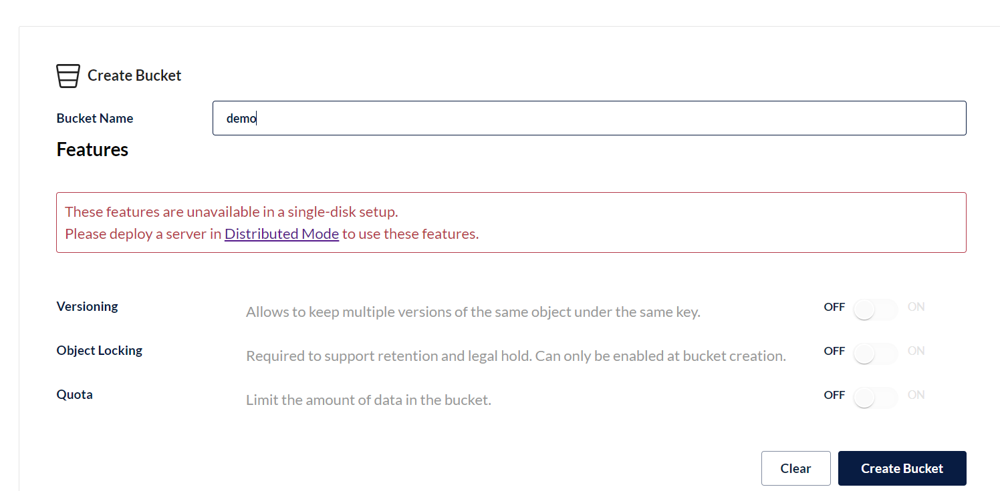
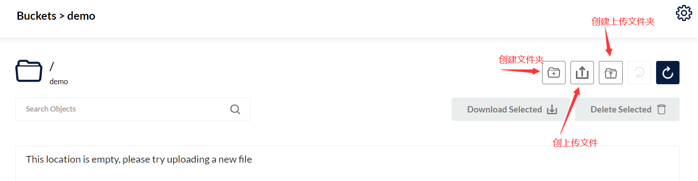
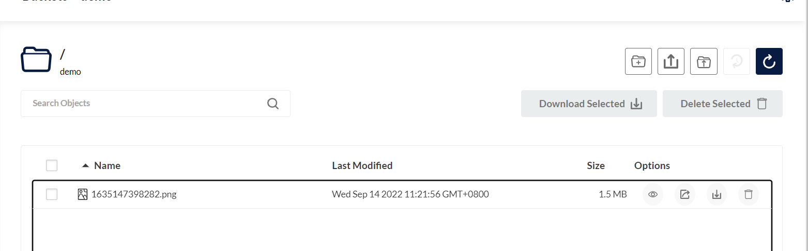
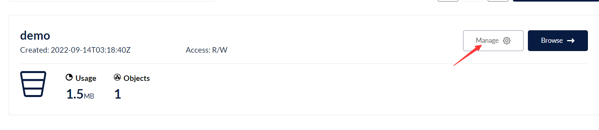
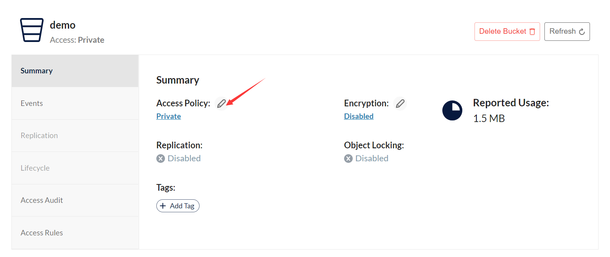

## 简介

`minio` 是一款高性能分布式文件存储软件

之前采用的`fastdfs` ,官方整合 docker,极其难用,第三方的整合也是很多坑点,而`minio` 则官方 docker 镜像,构建简单,并且自带的图形化界面

## 分布式介绍

所谓分布式存储,则是上传一分文件,你可以通过放问不同服务都可以访问到这个文件,

使用的是`纠删码`,是一种恢复丢失和损坏数据的数学算法， Minio 默认采用 Reed-Solomon code 将数据拆分成 N/2 个数据块和 N/2 个奇偶校验块。这就意味着如果是 16 块盘，一个对象会被分成 8 个数据块、8 个奇偶校验块，你可以丢失任意 8 块盘（不管其是存放的数据块还是校验块），你仍可以从剩下的盘中的数据进行恢复。

## 单机部署

```yaml
version: "1"
services:
  minio:
    image: minio/minio
    ports:
      - 9000:9000
      - 9001:9001
    environment:
      MINIO_ACCESS_KEY: root
      MINIO_SECRET_KEY: 12345678
    volumes:
      - /home/docker-compose/minio/data:/data
      - /home/docker-compose/minio/config:/root/.minio
    command: server --console-address ':9001' /data
    privileged: true
    restart: always
```

:::

账号 `root` 密码 `12345678`

其中,9000 为 api 访问地址端口

9001 为图形化界面的访问地址端口

:::

`docker-compose up -d ` 运行容器

访问 `http://ip:9001`

首先创建一个桶,所谓桶,可以理解为创建一个空间或者创建一张表,这样理解



然后 选择 `create bucket`



上传成功



创建桶后,默认桶访问权限是私有的,无法单独访问图片,需要到桶设置里改为 `public`



首先回到桶界面,

选择 `manage`



点击修改按钮,修改为 `public`

接着访问 `http://ip:9000/桶名称/文件名称` 就可以访问到刚才上传的图片

我们可以去数据存储目录可以看的我们存储的图片已经存在于我们设置的数据存储目录里了

## 集群部署

官方 `docker-compose.yaml` 文件有点问题,稍微修改得到一下正确文件

```yaml
version: "3.7"

# 所有容器通用的设置和配置
x-minio-common: &minio-common
  image: minio/minio
  command: server --console-address ":9001" http://minio{1...4}/data
  expose:
    - "9000"
  # environment:
  # MINIO_ROOT_USER: minioadmin
  # MINIO_ROOT_PASSWORD: minioadmin
  healthcheck:
    test: ["CMD", "curl", "-f", "http://localhost:9000/minio/health/live"]
    interval: 30s
    timeout: 20s
    retries: 3

# 启动4个docker容器运行minio服务器实例
# 使用nginx反向代理9000端口，负载均衡, 你可以通过9001、9002、9003、9004端口访问它们的web console
services:
  minio1:
    <<: *minio-common
    hostname: minio1
    ports:
      - "9001:9001"
    volumes:
      - ./data/data1:/data

  minio2:
    <<: *minio-common
    hostname: minio2
    ports:
      - "9002:9001"
    volumes:
      - ./data/data2:/data

  minio3:
    <<: *minio-common
    hostname: minio3
    ports:
      - "9003:9001"
    volumes:
      - ./data/data3:/data

  minio4:
    <<: *minio-common
    hostname: minio4
    ports:
      - "9004:9001"
    volumes:
      - ./data/data4:/data

  nginx:
    image: nginx
    hostname: nginx
    volumes:
      - ./nginx.conf:/etc/nginx/nginx.conf:ro
    ports:
      - "9000:9000"
    depends_on:
      - minio1
      - minio2
      - minio3
      - minio4
```

`nginx.conf` 文件内容

```
user  nginx;
worker_processes  auto;

error_log  /var/log/nginx/error.log warn;
pid        /var/run/nginx.pid;

events {
    worker_connections  4096;
}

http {
    include       /etc/nginx/mime.types;
    default_type  application/octet-stream;

    log_format  main  '$remote_addr - $remote_user [$time_local] "$request" '
                      '$status $body_bytes_sent "$http_referer" '
                      '"$http_user_agent" "$http_x_forwarded_for"';

    access_log  /var/log/nginx/access.log  main;
    sendfile        on;
    keepalive_timeout  65;

    # include /etc/nginx/conf.d/*.conf;

    upstream minio {
        server minio1:9000;
        server minio2:9000;
        server minio3:9000;
        server minio4:9000;
    }

    server {
        listen       9000;
        listen  [::]:9000;
        server_name  localhost;

        # To allow special characters in headers
        ignore_invalid_headers off;
        # Allow any size file to be uploaded.
        # Set to a value such as 1000m; to restrict file size to a specific value
        client_max_body_size 0;
        # To disable buffering
        proxy_buffering off;

        location / {
            proxy_set_header Host $http_host;
            proxy_set_header X-Real-IP $remote_addr;
            proxy_set_header X-Forwarded-For $proxy_add_x_forwarded_for;
            proxy_set_header X-Forwarded-Proto $scheme;

            proxy_connect_timeout 300;
            # Default is HTTP/1, keepalive is only enabled in HTTP/1.1
            proxy_http_version 1.1;
            proxy_set_header Connection "";
            chunked_transfer_encoding off;

            proxy_pass http://minio;
        }
    }

}

```

`docker-compose up -d ` 运行容器

接下来访问 `http://ip:9001` 其中 9001-9004 都可以访问

默认登录密码为 `minioadmin`

我们可以尝试上传一张图片,接着停止其中 1 号`minio`

docker-compose stop `minio1号名称`

再次访问图片,可以发现,等会一会后,仍然能访问这张图片,这样 就具备容灾能力
