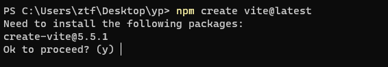
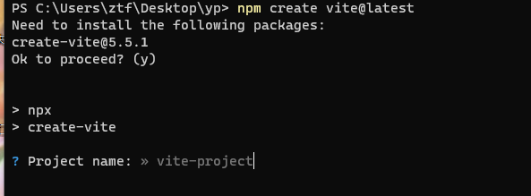
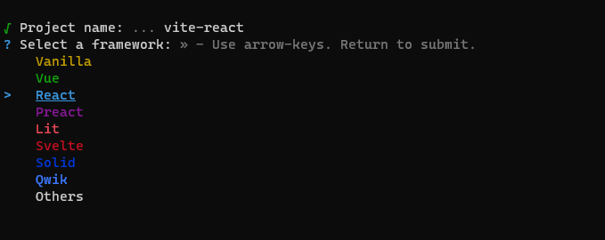
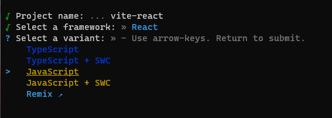
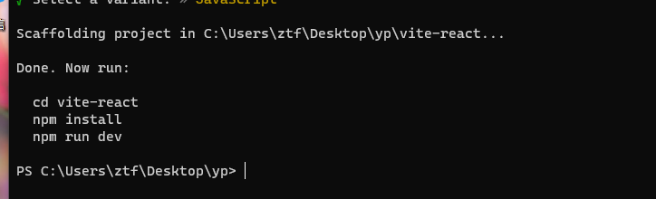
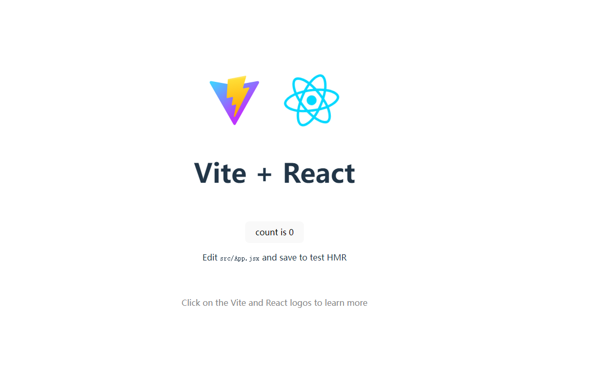
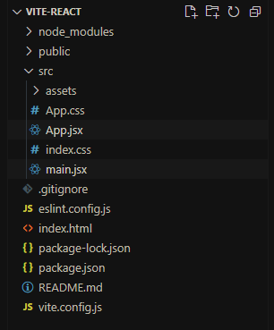

## vite 创建

通常我们在项目中不会像第一章 HTML 页面里写 react,而且也不是特别方便,vite 提供了 react 的脚手架,可以让我们快速创建一个工程化的 react 项目

在实际开发中我们都是使用工程化的 react 项目来进行开发

创建 react 只需要执行

```shell
npm create vite@latest
```

等待之后,可能会显示



只需要按回车就行,这里他的意思就是你没有安装 这个包,是否需要安装

在这里输入你的项目名后回车





这里是问你选择哪种框架,我们这里选择 react 就行,注意,这里是用方向键上下,来控制选择,最后回车就行



随后让我们选择语言,这里选择第三个 javascript 即可



出现这个后,表示下载成功,接着,我们用 vscode 打开 这个项目文件夹,然后当前项目的根目录下执行

```shell
# 安装依赖
npm install

# 启动项目
npm run dev
```

如果一切顺利的话,就可以打开浏览器访问 http://localhost:5173/

看到这个图表示 已经成功启动了

## 项目结构介绍



node_modules 表示项目的依赖包

public 表示项目的公开资源,例如可以放我们网站的 icon,这里就是放了 vite 项目的 icon,

src 表示原代码, 我们写 react 代码的地方,可以看到里面有 css 文件,jsx 文件,jsx 文件就是第一章学习的 jsx 语法

.gitignore 表示 git 忽略的文件和文件夹配置

eslint.config.js eslint 是一个可以检测代码规范,避免开发人员写错错误代码,可以帮我们检测错误

index.html 表示我们渲染的 html 文件 ,但是我们不在这个文件编写代码,这个文件几乎不用管

package-lock.json 和 package.json 是依赖相关

README.md 一般就是项目的描述

vite.config.js vite 的配置文件

基本上我们开发,只需要关注 src 即可

我们可以先看第一个文件 `main.jsx`

```jsx
import { StrictMode } from "react";
import { createRoot } from "react-dom/client";
import App from "./App.jsx";
import "./index.css";

createRoot(document.getElementById("root")).render(
  <StrictMode>
    <App />
  </StrictMode>
);
```

import 为引入相关依赖

可以看到这里有一个我们熟悉的 api createRoot() 和 render()

这里可以看到我们是挂载到一个 id 为 root 的 dom 上, 这里 StrictMode 可以去掉,避免后续产生其他问题

```jsx
import { StrictMode } from "react";
import { createRoot } from "react-dom/client";
import App from "./App.jsx";
import "./index.css";

createRoot(document.getElementById("root")).render(<App />);
```

这里可以看到,我们是渲染的 App 这个组件,我们点开 App.jsx

```jsx
function App() {
  const [count, setCount] = useState(0);

  return (
    <>
      <div>
        <a href="https://vitejs.dev" target="_blank">
          
        </a>
        <a href="https://react.dev" target="_blank">
          
        </a>
      </div>
      <h1>Vite + React</h1>
      <div className="card">
        <button onClick={() => setCount((count) => count + 1)}>
          count is {count}
        </button>
        <p>
          Edit <code>src/App.jsx</code> and save to test HMR
        </p>
      </div>
      <p className="read-the-docs">
        Click on the Vite and React logos to learn more
      </p>
    </>
  );
}
```

可以看到这里是一个函数式组件,组件声明了一个 count 的 useState,在下方点击按钮的时候,让 count +1

这段代码基本上和我们第一章写的 H1 函数式组件是一个意思,只是说,现在我们可以在一个单独的文件进行开发这个 jsx 内容,不用之前那样都写在一个 html 代码里,非常复杂

如何才能让 main.jsx 使用 App.jsx 呢,在 App.jsx 底部有一行 `export default App`

表示默认导出,这样在外部就可以通过 import 形式引用我们的 App.jsx 了

> 尝试在把 App.jsx html 内容 删掉,写一个自己的 App.jsx
