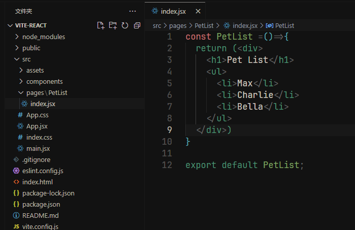

上一章,我们学习了,如何创建一个 vite 的工程化项目,本章就在上一章节上进行一些案例

一般,我们会在 src 创建一系列文件夹来区分不同的文件,例如页面,通用组件,工具类,公共的函数等等

pages: 页面文件夹,用于存放页面组件的地方,一般,我们写页面就是在这个文件夹下面写

components: 项目通用的组件,例如弹窗,按钮,公共头组件

config: 用于项目配置的信息

api: 用于调用接口的

以上是大部分项目通用的,有些项目有些自己的要求和分类

我们在 pages 下面创建一个新组件 PetList,react 项目有一个特点,创建组件一般都会先创建一个组件名字的文件夹 例如这里创建一个`PetList` 的文件夹,然后在文件里创建`index.jsx`的文件

```jsx
// 函数名字不一定必须叫这个,但是大多数人都默认使用文件夹名字来使用,也是一种默认的规范
const PetList = () => {
  return (
    <div>
      <h1>Pet List</h1>
      <ul>
        <li>Max</li>
        <li>Charlie</li>
        <li>Bella</li>
      </ul>
    </div>
  );
};

export default PetList;
```



要使用这个组件我们需要在 App.jsx 引入即可

```jsx
import PetList from "./pages/PetList";
function App() {
  return (
    <>
      <PetList />
    </>
  );
}
export default App;
```

打开页面应该就能看到我们的 `PetList` 页面

这里可以看到我们的 PetList 一个文件就是一个页面,如果内容太多,自然就要写很多代码,所以,我们对于复杂的页面,会拆分成好几个组件来展示,例如,我们可以把`h1` 的部分写一个单独的组件,`ul` 的部分也可以用一个单独的组件,这样就实现了页面组件分离,维护起来也更好 操作

对于页面级中的组件,我们会通常在页面组件的的目录下单独创建一个`components` 文件夹来存放

接着创建 `Header` 和 `List` 文件夹,然后分别创建 index.jsx 文件,然后我们把`PetList` 组件中的内容分别抽取到 `Header` 和 `List` 中

```jsx
const Header = () => {
  return <h1>Pet List</h1>;
};
export default Header;
```

```jsx
const List = () => {
  return (
    <ul>
      <li>Max</li>
      <li>Charlie</li>
      <li>Bella</li>
    </ul>
  );
};
export default List;
```

最后我们再删除 PetList 中,我们抽取的代码,替换上我们新写的组件

```jsx
import Header from "./components/Header";
import List from "./components/List";

const PetList = () => {
  return (
    <div>
      <Header />
      <List />
    </div>
  );
};

export default PetList;
```

这样就实现了页面中的组件抽离,在实际开发中,我们通常会抽取较为复杂的代码作为单独的组件以便维护

## react className

### css-modules

react class 有 2 种方式,一种是 `css-modules` 模式,还有一种是正常 css 模式

css-modules 是一种 CSS 模块化方案,

好处: 是让不同组件的 css 可以独立存在,哪怕写的 class 名一样也不会导致名称重复,可以获取编辑器的代码提示,可以快速跳转到指定 css 文件中

缺点是: 打包后 css 难以分辨,因为 css-modules 让名称不重复的方法是会在 class 名后添加 hash 值,用于防止重复

引入的方式是

```jsx
import styles from "./style.module.css";

这里注意必须要写 某某.module.css  这种写法

```

这里以 `List` 组件为例

```jsx
// 注意,这里叫 styles 是自定义的,可以叫任何名称,习惯性叫 styles
import styles from "./style.module.css";
const List = () => {
  return (
    <ul>
      <li style={styles.item}>Max</li>
      <li style={styles.item}>Charlie</li>
      <li style={styles.item}>Bella</li>
    </ul>
  );
};
export default List;
```

然后在 List 组件的 jsx 文件同级目录下创建`style.module.css`

```css
.item {
  color: violet;
}
```

回到页面就可以看到 li 的的颜色发生了变化

### index.css

另外一种方案是字符串形式
例如,以 `Header` 组件为例

```jsx
import "./index.css";
const Header = () => {
  return <h1 className="title">Pet List</h1>;
};
export default Header;
```

然后在 `Header` 组件 jsx 同级目录下创建`index.css`

```css
.title {
  font-size: 20px;
  font-weight: bold;
}
```

css 文件名可以是任意名字,但是不能是 `xxx.module.css` 这种

好处是打包后,className 名字不会混乱,好排查

坏处是不能获取编辑器的提示,无法快速点击到 css 样式地方,同一页面存在名字可能重复的问题,需要开发人员自己去判定

在大多数情况我们用第一种方案即可,少数情况可能需要用第二种方案
