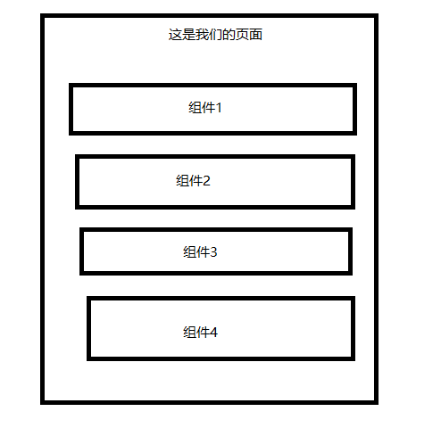

## 父子组件

在实际开发中,一个页面的代码非常多,随着项目继续开发,页面的代码会越来越多,导致维护困难,在这个时候,我们通常会把一个页面的代码拆分到不同的`jsx`文件中, 这些`jsx` 文件,我们统称为组件



可以看到,我们把页面拆分成了 4 个组件,每个组件都是独立的`jsx` 文件

这样方便我们不同的人在一个页面进行独立开发,开发完后,再统一合并到一个`jsx` 文件中,最终组成了我们的页面

其中 最终合并的 jsx 文件 我们叫`父组件`, 例如上图中,组件 1,组件 2,组件 3,组件 4 我们统称为 这个父组件的 子组件,拥有父子关系

以下是父子组件的用例

```jsx
// 这是我们的页面组件
import { useState } from "react";
import Header from "./components/Header";
import UserList from "./components/UserList";
import Footer from "./components/Footer";
const Page = () => {
  const [title, setTitle] = useState("这是标题");
  const [userList, setUserList] = useState(["zs", "ls", "ww"]);
  return (
    <div>
      <Header></Header>
      <UserList></UserList>
      <Footer></Footer>
    </div>
  );
};
return Page;
```

在 Page 组件中,我们引入了 3 个组件 `Header`,`UserList`,`Footer`,这 3 个组件,就是 Page 的子组件,而 Page 就是`Header`,`UserList`,`Footer`这 3 个组件的父组件

在 Page 组件的 jsx 文件目录下创建`components` 目录,用于存放 Page 组件的子组件
然后创建`Header`,`UserList`,`Footer`这 3 个组件

```jsx
const Header = () => {
  return <div>这里是 Header</div>;
};
return Header;
```

```jsx
const UserList = () => {
  return <div>这里是 UserList</div>;
};
return UserList;
```

```jsx
const Footer = () => {
  return <div>这里是 Footer</div>;
};
return Footer;
```

## props

一个页面,是有不同的数据渲染出来的,上面我们拆分了 Page 页面成三个独立的组件,我们如何才能把`Page` 页面的数据传递给我们的子组件呢,此时就需要使用 `react` 提供的 `props` 功能,所谓 props 就是用于把父组件的数据,传递给子组件,在上面的案例,我们需要把 `title` 传递给 `Header` 组件,把`userList` 传递给 `UserList` 组件

首先我们需要在我们的子组件中声明我们这个组件是需要接受外部传递数据的,写在`UserList`函数的参数上,通常是写成 `props` 这个名字,

```jsx
const Header = (props) => {
  // 一般我们在组件内使用解构的形式获取对象中的值(只是习惯,也可以不按照这样)
  const { title } = props; // 从props 中 获取由父组件传递过来的数据,名字叫title
  // 省略内容
  return <div>title:{title}</div>; // 把title 渲染到页面上面
};
```

其中函数式组件的参数就是我们的 props,其他组件想要传递则需要按照以下格式

```jsx
// 这是我们的页面组件
import { useState } from "react";
import Header from "./component/Header";
import UserList from "./component/UserList";
import Footer from "./component/Footer";
const Page = () => {
  const [title, setTitle] = useState("这是标题");
  const [userList, setUserList] = useState(["zs", "ls", "ww"]);
  return (
    <div>
      <Header title={title}></Header> {/* 在这里用,我们把title 传递给子组件 */}
      <UserList></UserList>
      <Footer></Footer>
    </div>
  );
};
return Page;
```

回到页面就可以看到父组件中的值,在子组件中给渲染出来了

这里需要注意,子组件中的 props 变量是不能在组件进行更改的,不能去修改子组件的 props 值,我们只能通过父组件的函数进行修改

props 中可以传递任何值,也可以传递一个函数进来

```jsx
import { useState } from "react";
import Header from "./component/Header";
import UserList from "./component/UserList";
import Footer from "./component/Footer";
const Page = () => {
  const [title, setTitle] = useState("这是标题");
  const [userList, setUserList] = useState(["zs", "ls", "ww"]);

  const handleChangeTitle = (title) => {
    setTitle(title);
  };

  return (
    <div>
      <Header title={title} updateTitle={handleChangeTitle}></Header> {/* 在这里用,我们把handleChangeTitle 传递给子组件 */}
      <UserList></UserList>
      <Footer></Footer>
    </div>
  );
};
return Page;
```

然后修改子组件的参数,

```jsx
const Header = (props) => {
  // 一般我们在组件内使用解构的形式获取对象中的值(只是习惯,也可以不按照这样)
  const { title, updateTitle } = props; // 从props 中 获取由父组件传递过来的数据,名字叫title,这里的updateTitle 就是父组件传递过来的handleChangeTitle

  // 省略内容
  return (
    <div>
      title:{title}
      <button onClick={() => updateTitle("hxg")}>请点击更改</button>
    </div>
  ); // 把title 渲染到页面上面
};
```

这里可以看到我们虽然在父组件里写的是 `updateTitle={handleChangeTitle}`
但是在子组件我们这个函数的名字是`updateTitle` 所以,props 的名称,不一定要和变量名称一致

此时我们点击按钮,就会触发 `updateTitle` 而`updateTitle` 实际上是父组件的`handleChangeTitle` 这个函数,所以触发`updateTitle`的本质上是触发了`handleChangeTitle` 这个函数

注意 props 可以无限传递,可以传递给子组件的子组件 但是比较繁琐,对于这种情况 react 有解决方案,后续会讲

练习下,把 把父组件的`userList` 变量传递给 `UserList` 组件,进行渲染

::: warning 提示
我们知道当组件内调用 setXXX 的时候会使页面重新渲染,也就是让函数组件重新执行一次,
如果在父组件内使用了 setXXX 的 useState 函数时,父组件重新渲染的同时,子组件也会重新渲染,
但是如果子组件进行 setXX 的时候,并不会触发父组件的渲染
:::

## 组件嵌套

有时候,我们希望我们封装的组件能够实现嵌套复用,例如,二手交易市场, 移动端 h5 项目,页面都有一些共同的部分

例如,左上角都有返回箭头,点击可以返回上个页面,每个页面 header 头中间都有当前页面的名字,所以我们可以吧这些内容都封装成一个组件,实现方式有 2 种,单独写一个`Header` 组件,然后在每个页面中引入,
例如

页面 1

```jsx
const Page1 =()=>{
  return (
    <>
     <Header title="页面1" />
      <User />
    <>
  )
}
```

页面 2

```jsx
const Page2 =()=>{
  return (
    <>
      <Header title="页面2" />
      <User />
    <>

  )
}
```

页面 3

```jsx
const Page2 =()=>{
  return (
    <>
      <Header title="页面3" />
      <User />
    <>
  )
}
```

这种方式相当于是独立的组件,如果我们这个组件只有这些功能,那可以这么写

但是如果我们的页面需要让除了 header 以外的区域进行滚动;设置页面的背景颜色,如果这种公共的功能每个页面都要写一遍非常繁琐,所以有了另外一种使用场景组件嵌套

这里我们定义一个公共的组件 `Page`,注意这样的通用组件,放在项目的 `components` 文件夹下

```jsx
const Page = (props, ref) => {
  const {
    title, // header 中的页面标题
    right, //右边的内容
    backIcon = "这里是默认的返回icon",
    showNavBar = true, //是否显示头部的
    children,
  } = props;

  const handleBack = () => {
    location.back();
  };
  return (
    <>
      {showNavBar && (
        <div>
          <div onClick={handleBack}>{backIcon}</div>
          <div>{title}</div>
          <div>{right}</div>
        </div>
      )}
      <div>{children}</div>
    </>
  );
};
export default Page;
```

我们定义了这么一个 Page 通用组件,他的 props 有

```js
const {
  title, // header 中的页面标题
  right, //右边的内容
  backIcon = "icon", //返回的icon样式,有一个默认值
  showNavBar = true, //是否显示头部的
  children,
} = props;
```

我们根据`showNavBar` 值来判定是否显示 header 信息
往下有个 div 内容是 `children` 这个就表示 Page 组件下 的全部内容子组件,注意这里一定是叫这个名字

接着我们创建一个新页面

```jsx
const UserPage = ()=>{
  return <>
    <Page title="用户信息页">
      <div>div1</div>
      <div>div2</div>
      <div>div3</div>
      <div>div4</div>
      <div>div5</div>
      <div>div6</div>
    </Page>
  <>
}
```

这里可以看到,我们实现了自定义组件的嵌套,写起来就和 普通的 html 标签一样,这样我们就可以在每个页面使用这个`Page` 组件嵌套,减少我们写重复代码,项目开发中可能会嵌套好几层

前面不是提到`props` 可以是任意值吗,我们不仅可以传递函数,还可以传递一个 react 组件到页面中,可以看到,我们在`Page` 组件中的 props 使用了 `right ` 这个变量,这个主要是放在页面头部的右侧,把头部分成三部分,左中右,这样我们就可以根据场景选择性的传入不同右侧组件,可以实现非常灵活的使用

一下是使用方式

```jsx
const UserPage = ()=>{

  // 定义一个函数式组件,注意,react 虽然允许你在组件内定义组件,但是很少我们这么操作,你可以写在外面,单独的文件,或者写在当前 UserPage 函数外都可以,
  const Right = ()=>{
    return <h2>右侧内容</h2>

  }

  return <>
    <Page title="用户信息页" right={Right()}>
      <div>div1</div>
      <div>div2</div>
      <div>div3</div>
      <div>div4</div>
      <div>div5</div>
      <div>div6</div>
    </Page>
  <>
}

```

这样就可以看到右侧内容已经被渲染出来了,为什么传入 right 就会渲染出来呢,因为我们最开始写 Page 组件的时候把 `right`已经渲染在 div 上了,可以回头看下`Page` 组件

## 挑战

把购物车页面拆分成几个组件,并使用 props 方式进行传递数据
