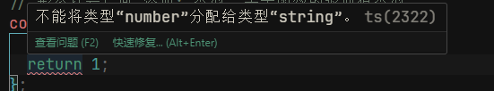
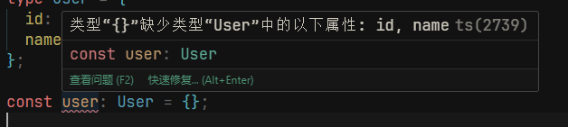

## 什么是 typescript

::: warning 提示
下面会把 `typescript` 简称为 ts
:::
ts 是 js 的一个扩展语言,相当于在 js 的基础上增加新内容,但不改变以前的内容

我们知道 js 是弱类型语言,弱类型语言有一些好处,

例如:写代码的时候不用过多考虑类型到底声明成什么,编译器会自动识别,没有特别多的负担,弱类型就是主打一个简单快捷

但是缺点也很明显,当参与到大型项目开发的时候,js 的弱势便是展示出来

1. 首先,大型项目组件,方法很多,参与的人,也是五花八门,如果我们不知道一个组件需要传递的数据是什么类型,我们就需要去阅读别人的源码,十分麻烦,非常浪费时间,假如,我们可以给组件的类型或者给方法参数加上类型,我们便知道传入的数据是什么类型的,可以减少在开发中的一些时间,和不必要的操作
2. 其次,如果我们给对象设置了类型,编辑器便能知道对象中有哪些属性,可以提示给我们开发人员,这样也能提高我们的开发体验

总得来说有了 ts 可以让我们开发变的很舒服,可以减少开发中的一些不必要的错误

ts 写起来和 Java 一样,ts 相比于 js 只是多了类型声明,没有增加其他的方法

::: warning 提示
由于 ts 需要特殊的编译环境,所以下面代码仅编写出来即可,无需考虑允许结果,只需要保证 js 语法是正确的即可,我们只需要创建文件后缀为`ts` 即可
:::

## 快速体验

创建一个`index.ts` 文件

```ts
// 声明一个 数字类型 变量    :number  表示这个变量是数字类型的
const age: number = 20;

// 给函数参数和返回值声明类型
// 形参括号里 变量名:类型    表示给这个变量声明类型
// 形参括号后面 添加: 类型  表示函数的返回值类型
const handleClick = (name: string, age: number): string => {
  console.log(name);
  return name;
};
// 如果我们不进行正确的返回值,则编辑器会提示我们错误
```

函数的返回值类型,大多数时候可以不用写,因为 ts 编译器可以自动帮我们推测,我们的返回值他是什么类型例如刚才`handleClick` 函数

如果把返回值类型去掉,ts 是可以知道,我们返回的是字符串类型,因为`name` 是字符串,他可以从你返回的变量的类型进行推测,所以大多数时候我们没有写返回值的类型

我们把 `handleClick`的返回值改成 `return 1` 可以看到编辑器给我们提示了错误

```ts
const handleClick = (name: string, age: number): string => {
  console.log(name);
  return 1;
};
```


但是注意,这个只是编辑器报错,并不影响代码运行,但是存在未知的风险,假如,一个函数是返回 number 类型后要进行加减运算,但是,我们实际上返回了一个字符串类型,如果这个字符串后面和其他的数字类型进行运行,则会出现运算错误,所以这就是未知风险,我们要尽可能的避免 ts 这种问题

在上述代码中,`number`, `string` 这是 ts 的的基础类型

## ts 的基础类型

1. boolean:布尔类型 对应 js 的 true;false
2. number:数字类型,对应 js 的 整数,和浮点数
3. string:字符串类型,对应 js 的字符串
4. []:数组,通常我们在声明数组类型的时候,还会声明数组里是什么类型,例如
   string[]:字符串数组,number[]:数字类型的数组,只要是[]前面是什么类型,那么这个数组就只能存入这个类型

```ts
// 数组
const ids: number[] = [];
ids.push(1); // 正确
ids.push("1"); // ts 会报错,但是任然可以存入到ids中
```

## 自定义类型

ts 提供的基础类型肯定不足以我们项目使用的,我们在项目更多是需要自定义类型,例如后端返回的一个`User` 对象,所以我们需要顶一个`User` 类型的对象

例如:

```ts

// 这里是使用type 关键词声明类型,注意,类型后面的分号,可写可不写,但是不能写其他符号
type User = {
  id:number;
  name:string;
}

//另外一种方法,使用 interface
interface {
   id:number;
   name:string;
}

```

以上 2 种方法可以自定义类型
使用哪种都可以,并没有实际上约束,只是我们更多会在组件的文件中写 type 关键词,在单独的 ts 文件中时,会写 interface
但是实际上,并没有什么规定,只是看个人习惯

有了以上类型后,我们就可以赋值给变量了

```ts
type User = {
  id: number;
  name: string;
};
const user: User = {};
```

但是此时会出现一个 ts 错误


因为 User 类型中如果没有添加`?` 可选类型的话,则表示改属性必填

现在我们修改为正确的对象

```ts
const user: User = {
  id: 123,
  name: "hxg",
};
```

刚才提到`?` 可选类型,则是按照一下写法,在对象属性名称前面加上 `?`,例如:

```ts
type User = {
  id?: number;
  name?: string;
};
const user: User = {};
```

这样,编辑器就不会出现报错,这样就告诉其他开发人员,这个属性他是可选项,

## 函数类型

在 ts 中,可以用箭头语法来表示这个是一个函数类型,例如

```ts
type Page = {
  back: () => void;
  onClick: () => string;
  onSend: (content: string) => string;
};
```

以上列举了几种写法,

第一种 表示`back` 是一个没有参数,没有返回值的函数,void 表示无返回值

第二种表示 onClick 是一个没有参数,但是有返回值的函数,返回值的类型是 string

第三种 表示 onSend 是有一个参数,有一个返回值的函数,参数的类型是 string,返回值的类型也是 string

我们可以实现下上面的这个类型的参数

```ts
const page: Page = {
  back: () => alert(),
  onClick: () => "hxg",
  // 这里第一个content 是形参的名字,可以是任意的,不一定是类型声明写的那个
  onSend: (content) => content,
};

page.back();

const name = page.onClick();

const content = page.onSend("hxg");
```

## 联合类型

在 Java 中,一个变量只能有一个类型,你声明他是`int` 后,就不能在声明成 string,因为 Java 是强类型,Java 虚拟机,会给这个变量分配`int` 大小的内存空间,但是`js` 不一样,`js` 是弱类型语言,一个变量哪怕最开始是`int`类型,后面也可以变为`string` 字符串类型,`ts` 虽然可以给变量添加类型,但是实际上,编译出来的时候,编译器会把我们写的类型全部删除,只剩下`js`代码,所以`ts` 提供了可以给变量赋予 2 个类型甚至多个类型的语法

```ts
let age: string | number;
```

通过 `|` 表示他既可以是`string` 类型,也可以是`number` 类型,我们在进行赋值的时候,就可以写字符串,或者数字类型

```ts
let age: string | number;
age = "18"; //ts 不报错
age = 18; // ts 不报错
age = null; // ts 报错,因为只允许 字符串或者数字类型
```

## 泛型类型

`ts`的泛型 和`Java`的泛型是一样的意思,泛型一般是写在函数的参数上,或者给类型 type 或者 interface 上使用

```ts
const fun = <T, R>(p1: T, p2: R) => {
  console.log(p1, p2);
};
```

这里定义了一个函数 fun,函数有个参数,p1 和 p2,参数的类型是由外部决定的,例如,我如果要使用 fun 的话,就需要一下写法

```ts
fun<string, number>("1", 2);
```

这样就表示,此时 fun 的第一个参数是 string 类型,第二个参数为 number 类型,如果我们都传入`"1"` 字符串的 1,则会提示类型错误

通常,很少需要我们自己去定义泛型,很多时候都是使用别人写好的函数,而这个函数,需要自己定义参数类型,例如`react` 中的`useState` 则是需要自己定义存储的是什么类型的数据,`useMemo` 也是同理

## any 类型

any 是 ts 最大的类型,使用 any 类型,可以无视 ts 的其他类型检测,尽量少使用 any 类型,如果使用 any 类型,就和跟没有 ts 的一样的意思

```ts
const fun = (age: any) => {};
```

声明 any 后,ts 会无视传入的类型

可以给某个变量声明为 any

```ts
let name: any = "";
```

但是这里声明 any 后便没有任何 ts 能力了

## as 语法

很少用,遇到了再查
