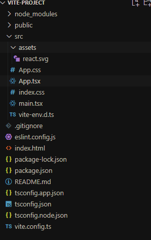

前面一章,我们学了 typescript,这章我们把 typescript 与 react 结合起来,

## 搭建项目

首先在一个空文件夹下面 打开 cmd

```shell
npm create vite@latest

```

接着等待一会后,会出现 第二节的脚手架 一样的流程输入

1. 首先输入项目名称 回车
2. 选择 `react` 框架 回车
3. 选择`typescript` 第一个选项 回车

进入到新创建项目文件夹内,打开 cmd 执行 `npm i` 进行安装依赖

用 vscode 打开后,可以看到,基本和我们之前创建的是一样的,但是多了些其他内容


可以看到我们以前的`jsx` 文件变成了`tsx`, 这个就是 react 和 typescript 的结合文件

vite-env.d.ts : 这是 vite 自带的 ts 类型,里面有一些全局使用的类型

tsconfig.app.json:`typescript` 的配置文件,我们不用管,默认的就够用

ts.config.json :`typescript` 的配置文件,我们不用管,默认的就够用

ts.node.json :`typescript` 的配置文件,我们不用管,默认的就够用

::: warning 提示
只要是 typescript 项目,以前创建的`jsx` 文件,现在需要改成`tsx` 后缀,
`js` 后缀文件,需要改成`ts` 后缀文件

:::
