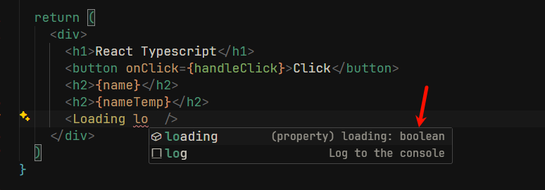

前面一章,我们学了 typescript,这章我们把 typescript 与 react 结合起来,

## 搭建项目

首先在一个空文件夹下面 打开 cmd

```shell
npm create vite@latest

```

接着等待一会后,会出现 第二节的脚手架 一样的流程输入

1. 首先输入项目名称 回车
2. 选择 `react` 框架 回车
3. 选择`typescript` 第一个选项 回车

进入到新创建项目文件夹内,打开 cmd 执行 `npm i` 进行安装依赖

用 vscode 打开后,可以看到,基本和我们之前创建的是一样的,但是多了些其他内容


可以看到我们以前的`jsx` 文件变成了`tsx`, 这个就是 react 和 typescript 的结合文件

vite-env.d.ts : 这是 vite 自带的 ts 类型,里面有一些全局使用的类型

tsconfig.app.json:`typescript` 的配置文件,我们不用管,默认的就够用

ts.config.json :`typescript` 的配置文件,我们不用管,默认的就够用

ts.node.json :`typescript` 的配置文件,我们不用管,默认的就够用

::: warning 提示
只要是 typescript 项目,以前创建的`jsx` 文件,现在需要改成`tsx` 后缀,
`js` 后缀文件,需要改成`ts` 后缀文件

:::

接着,我们可以在在 react ts 项目中使用下

## useState 泛型

首先,我们使用下 useState 如何定义泛型的

在`app.tsx`

```tsx
import { useState } from "react";

function App() {
  // 定义一个 useState 的变量  并且他的类型是string
  const [name, setName] = useState<string>();

  const handleClick = () => {
    setName("React Typescript");
  };

  return (
    <div>
      <h1>React Typescript</h1>
      <button onClick={handleClick}>Click</button>
      <h2>{name}</h2>
    </div>
  );
}

export default App;
```

上面代码表示,当我们点击按钮的时候,就会切换 `name` 的值,

可以看到 我们给 `useState` 后面添加一个 `<string>` 这个就表示泛型 并且泛型的类型是`string`, 这里的泛型的作用表示,`name` 的类型是`string` 类型的 ,并且 setName 也只能传入 string 类型,不能传入其他类型,如果我们传入其他类型,编辑器会给出错误提示
例如,如果我们传入的是 number 类型,则会给出以下错误提示


但是为什么 我们给 `useState` 添加 string 的泛型后,`name` 就是 string
类型了呢?这个是由源码函数决定的,以下是省略版本的 `useState` 源码

我们知道 `useState` 函数,可以传入一个值,也可以不传入,所以,函数的参数是可选的,并且,函数会返回一个数组,数组里有 2 个值

```ts
const useState = <T>(parmState?: T) => {
  // 声明一个变量 变量的类型是 T或者是undefined(未定义)
  // 未定义的意思就是,只声明,没有赋值 例如 let name;   此时name 就是未定义
  //这里是因为  parmState 是可选的传入参数,所以可以不传入parmState,如果 在调用useState的时候没有给函数传入参数,则 parmState 的值是 undefined
  let state: T | undefined = parmState;

  const setState = (newState: T) => {
    state = newState;
  };
  // 这里用了一个数组返回的,数组的第一个值,就是上一个例子的name,数组的第二个值就是 setName
  //为什么这里是叫state ,而上个例子里我们写的name,是因为, const [name, setName] = useState<string>();  这个是一个解构语法,数组的解构语法,跟我们调用的函数返回的变量名称没有关系,只跟数组的下标,索引,有关系,所以,可以取任意名称
  return [state, setState];
};
```

可以看到在第二行,`let state: T = parmState;` 这里声明了`state` 的类型是`T`类型,在上个例子中,我们泛型传入的是 string,所以这里的 T 类型,其实就变成了`string` ,所以这就是为什么 我们的`name` 是`string` 类型的

在初期,我们只需要记住几个关键的 react 内置的函数的泛型表示的意义就可以了

useState 的泛型不只是可以传入普通的类型,还可以传入自定义的对象类型,或者数组

例如

```ts
// 这里用type 来声明类型
type User = {
  id: number;
  name: string;
};
const [user, serUser] = useState<User>();

setUser({
  id: 1,
  name: "zs",
});
```

## useMemo 泛型

useMemo 的泛型和 useState 一样

```tsx
import { useMemo, useState } from "react";

function App() {
  const [name, setName] = useState<string>("");

  //  useMemo 只有一个泛型参数,这里我们声明成string ,表示  useMemo 的返回值的类型 是string类型
  const nameTemp = useMemo<string>(() => {
    // 这里只是做一个简单的字符串拼接
    return "(" + name + ")";
  }, [name]);

  const handleClick = () => {
    setName("1");
  };

  return (
    <div>
      <h1>React Typescript</h1>
      <button onClick={handleClick}>Click</button>
      <h2>{name}</h2>
      <h2>{nameTemp}</h2>
    </div>
  );
}

export default App;
```

和 useState 同理,useMemo 也可以声明成任意类型

## useRef

ref 的泛型也是同样如此

```tsx
import { useMemo, useRef, useState } from "react";

function App() {
  const [name, setName] = useState<string>("");

  const nameTemp = useMemo<string>(() => {
    return "(" + name + ")";
  }, [name]);

  // 在这里,我们声明 useRef 的泛型类型,为string
  const nameRef = useRef<string>("这是useRef的默认值");
  console.log(nameRef.current);
  const handleClick = () => {
    setName("1");
    nameRef.current = "这里是nameRef";
  };

  return (
    <div>
      <h1>React Typescript</h1>
      <button onClick={handleClick}>Click</button>
      <h2>{name}</h2>
      <h2>{nameTemp}</h2>
    </div>
  );
}

export default App;
```

打开控制台,可以看到`这是useRef的默认值` 被打印,当我们再次点击按钮的时候,可以发现`这里是nameRef` 被打印

## props 类型声明

之前我们学 props 的时候,其实如果我们是用别人写好的组件,我们是不知道 别人写的 props 是需要传入什么类型的参数,但是有了 ts 就不一样了,我们可以给 props 添加类型声明,这样别人在用你的组件的时候,就可以知道该传入什么样的值,这个值的类型是什么

这个是我们之前写过的 `Loading`组件, 我们现在给 props,添加一个类型

```tsx
import styles from "./index.module.css";
// 这里 的props 可以叫任意值,不一定叫props,我们通常叫props,因为这是一个约定俗成的名字
// props 表示的是父组件传递给子组件的数据

// 声明props 的类型  一般我们喜欢取名字为 组件的名称+Props
// 这里表示我们的的props 中有一个变量,这个变量是必须传入的,并且这个变量是类型是布尔类型
type LoadingProps = {
  loading: boolean;
};

// 在函数参数这里给props 声明 是 LoadingProps 这个类型
const Loading = (props: LoadingProps) => {
  // 这里的loading 是从父组件传递过来的,这里的loading 是一个布尔值,如果为true,则显示加载中,如果为false,则不显示加载中
  const { loading } = props;
  // 如果loading 为false,则返回null,不显示加载中
  if (!loading) {
    return null; // react中,如果返回null,则表示不显示任何内容
  }
  // 如果loading 为true,则显示加载中
  return (
    <i className={styles.loading}>
      
    </i>
  );
};

export default Loading;
```

然后当我们在 App.tsx 中引入

```tsx
import { useMemo, useRef, useState } from "react";
import Loading from "./components/Loading.tsx";

function App() {
  const [name, setName] = useState<string>("");

  const nameTemp = useMemo<string>(() => {
    return "(" + name + ")";
  }, [name]);

  const nameRef = useRef<string>("这是useRef的默认值");
  console.log(nameRef.current);
  const handleClick = () => {
    setName("1");
    nameRef.current = "这里是nameRef";
  };

  return (
    <div>
      <h1>React Typescript</h1>
      <button onClick={handleClick}>Click</button>
      <h2>{name}</h2>
      <h2>{nameTemp}</h2>
      <Loading />
    </div>
  );
}

export default App;
```

当我们引入`<Loading />` 组件的时候,可以看到编辑器给我们错误提示,鼠标悬浮到 `Loading` 上,可以看到


告诉我们`Loading` 这个组件需要传入一个 props ,这个 props 的名称叫`loading`

然后我们写入 loading props



可以看到这里,已经有提示了,并且是布尔类型, 这种强大的类型提示和参数变量提示,就是全靠 ts 才能实现,如果是之前的 jsx 文件,是完全无法实现这样的提示的,

```tsx
import { useMemo, useRef, useState } from "react";
import Loading from "./components/Loading.tsx";

function App() {
  const [name, setName] = useState<string>("");

  const nameTemp = useMemo<string>(() => {
    return "(" + name + ")";
  }, [name]);
  // 这里我们创建一个  useState 他的泛型是 布尔类型,默认值是true
  const [loading, setLoading] = useState<boolean>(true);

  const nameRef = useRef<string>("这是useRef的默认值");
  console.log(nameRef.current);

  const handleClick = () => {
    setName("1");
    nameRef.current = "这里是nameRef";
    // 当我们点击按钮的时候,就吧 loading的值设置为false
    setLoading(false);
  };

  return (
    <div>
      <h1>React Typescript</h1>
      <button onClick={handleClick}>Click</button>
      <h2>{name}</h2>
      <h2>{nameTemp}</h2>
      {/* 传入我们的loading 变量 */}
      <Loading loading={loading} />
    </div>
  );
}

export default App;
```

回到页面,当我们点击按钮的时候,就可以让`Loading` 组件停止
