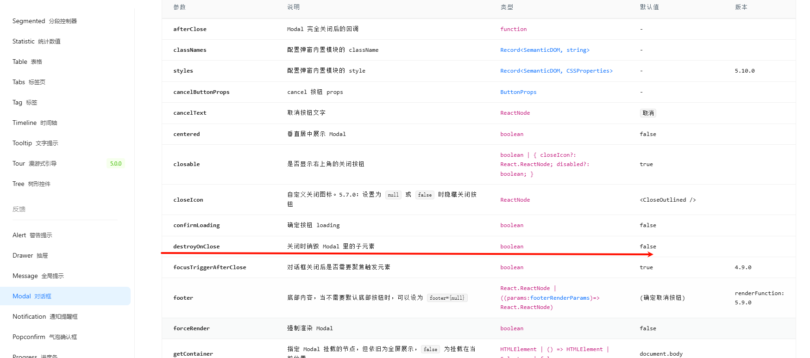

我们知道，像 `react` 和 `vue` 这种框架都是组件化开发。组件的意思是可以重复使用，减少重复开发。但是，如果一个项目从 0 开始全部实现一遍，需要开发特别多代码，而且很多组件没有任何重复开发的意义。例如，表格组件和弹窗组件，这些都是拥有极高重复性的组件。

在 `vue` 里的组件库代表是饿了么的 `element ui`。

在 `react` 里的组件库代表是阿里开发的 `antd`。

官方文档: [https://ant-design.antgroup.com/components/button-cn](https://ant-design.antgroup.com/components/button-cn)

组件库的用法本质上是大差不差的,vue 里,怎么样,react 里就怎么样

首先我们跟着文档进行一次安装,学会如何看文档也是一种技能

像这个页面,一般来说,我们首先是看这个页面,这个页面给我们描述了这个组件的特点,兼容性,以及,如何安装
[https://ant-design.antgroup.com/docs/react/introduce-cn](https://ant-design.antgroup.com/docs/react/introduce-cn)

来到这个安装的步骤[https://ant-design.antgroup.com/docs/react/introduce-cn#%E5%AE%89%E8%A3%85](https://ant-design.antgroup.com/docs/react/introduce-cn#%E5%AE%89%E8%A3%85)

让我们使用 `npm install antd --save`

我们在项目目录下执行这个命令

安装完后,我们可以在回到之前的 app.tsx


我们在这里写`<Bu` 的时候,可以看到编辑器给了我们提示,可以看到这个名称是大写的,代表这个是一个组件,在 Button 最后,写着`antd` 表示这个`Button` 组件是 antd 组件库的,选中这个,回车 ,就会自动引入包,回到页面就可以看到我们的内容

```tsx
import { Button } from "antd";

function App() {
  return (
    <div>
      <Button>这是antd的按钮</Button>
    </div>
  );
}

export default App;
```

## 组件库文档

学组件库不在于需要把全部内容都学一遍,而是在于如何去查看官方文档

这个是按钮的文档
[https://ant-design.antgroup.com/components/button-cn](https://ant-design.antgroup.com/components/button-cn)

可以看到有非常多的样式可以供我们设置,
如果我们需要查看代码点击这个 即可


可以看到文档是,可以通过设置 type 值,来改变按钮的样式,


可以把按钮的官方给的几个案例都写下,主要是熟悉组件库的写法,

在最下面 有一个表格,这个表格给了按钮可以传入的 props 的值,以及他的作用,类型,以及默认值


## 按钮loading
按钮组件里有一个`loading`,的 props,当`loading={true}` 的时候,按钮会出现转圈,这个可以用在用户提交信息的时候,防止用户重复点击

我们来简单模拟一个场景

```tsx
import { Button } from "antd";
import { useState } from "react";

function App() {
  const [value, setValue] = useState("");

  const submit = async () => {
    console.log(value);
  };

  return (
    <div>
      <div>
        <input type="text" onChange={(e) => setValue(e.target.value)} />
      </div>
      <div>
        <Button type="primary" onClick={submit}>
          提交数据
        </Button>
      </div>
    </div>
  );
}

export default App;
```

当我们在输入框输入完内容后,点击按钮,就会打印我们的 value 值,但是,这个按钮,我们可以无限次点击,`submit` 函数就会执行很多次,在实际开发中,我们会在`submit` 函数中调用接口,给后端发送数据,请求的时候,难免会存在网络延迟等情况,我们要避免这种用户重复提交的问题

为此,antd 的按钮就给了一个`loading`的 props 提供给我们

```tsx
import { Button } from "antd";
import { useState } from "react";

function App() {
  const [value, setValue] = useState("");
  // 创建一个loading的useState变量
  const [loading, setLoading] = useState(false);

  const submit = async () => {
    //当用户点击后,设置loading为true
    setLoading(true);
    console.log(value);
  };

  return (
    <div>
      <div>
        <input type="text" onChange={(e) => setValue(e.target.value)} />
      </div>
      <div>
        <Button type="primary" loading={loading} onClick={submit}>
        提交数据
        </Button>
      </div>
    </div>
  );
}

export default App;
```

当我们点击按钮后,按钮就不能再次点击了,就一直处于加载中,我们会在请求结束的时候,来使loading 为false 停止加载

这里由于我们没有安装`axios`,我们安装一次 在控制台打开,输入
```shell
npm i axios
```
安装好了后,我们在`submit` 函数里调用这里提前准备好的接口 这个接口的延迟有2s,2s后才会返回数据
https://apifoxmock.com/m1/5204577-4870723-default/loading


```tsx
import { Button } from 'antd'
import axios from 'axios'
import { useState } from 'react'

function App() {

  const [value,setValue] =  useState("")
  // 创建一个loading的useState变量
  const [loading,setLoading] =  useState(false)


  const submit = async () => {
    //当用户点击后,设置loading为true
    setLoading(true)
    // 在这里请求接口,注意这里{value} 是一个省略的语法 原样式是 {value:value} 当key和value的名称相同的时候可以省略value
    const result = await axios.post("https://apifoxmock.com/m1/5204577-4870723-default/loading",{value})
    console.log(result.data)
    //请求结束后,设置loading为false
    setLoading(false)
  }

  return (
    <div>
      <div><input type="text" onChange={e=>setValue(e.target.value)} /></div>
      <div>
        <Button type="primary" loading={loading} onClick={submit}>提交数据</Button>
      </div>
    </div>
  )
}

export default App

```

但是这样还不太好,万一,后端接口报错了怎么办,所以我们需要用try catch 来捕获异常,然后在final 再设置我们的`setLoading(false)`
```tsx
import { Button } from "antd";
import axios from "axios";
import { useState } from "react";

function App() {
  const [value, setValue] = useState("");
  // 创建一个loading的useState变量
  const [loading, setLoading] = useState(false);

  const submit = async () => {
    try {
      //当用户点击后,设置loading为true
      setLoading(true);
      const result = await axios.post(
        "https://apifoxmock.com/m1/5204577-4870723-default/loading",
        { value }
      );
      console.log(result.data);
      //请求结束后,设置loading为false
      setLoading(false);
    } catch (e) {
      console.log(e);
    } finally {
      //不管请求成功还是失败,最终都要设置loading为false
      setLoading(false)
    }
  };

  return (
    <div>
      <div>
        <input type="text" onChange={(e) => setValue(e.target.value)} />
      </div>
      <div>
        <Button type="primary" loading={loading} onClick={submit}>
          提交数据
        </Button>
      </div>
    </div>
  );
}

export default App;


```

记住我们需要在 finally 里最终保证我们的 loading 一定是可以恢复成false的即可


## AutoButton

讲到这里,我们可以顺便,可以再封装下这个按钮,

你可以看到,这里我们只有一个按钮,会提交数据,在真实项目里,存在大量的按钮会提交数据,如果是这样,那么,我们需要在每个接口请求的地方,都加上 上述的try catch

以及`setLoading(true);`和 `setLoading(false)` ,写1,2个还好,如果写大量这种重复的,就会感觉非常的繁琐,
因为这些loading 其实和我们业务没有关系,在`submit` 函数中,其实我们只是做了这么请求接口这么一件重要的事,其他的`setLoading` 都是有点多余,那么我们可以基于antd的按钮,封装一个可以用于请求接口后,就自动进入loading 状态,如果请求结束,那么就恢复


我们可以把 `setLoading(true);`和 `setLoading(false)` 放在一个通用的组件里

这个组件的名字我们叫`AutoButton` ,在项目根目录下的 `components` 文件夹里创建一个 `AutoButton` 的组件,注意,要先创建`AutoButton` 文件夹,然后再创建`index.tsx`

```tsx

import { Button } from "antd";
import { useState } from "react";

// 声明这个按钮组件的props 类型,方便使用者传入正确的类型
type AutoButtonProps = {
    // 这里表示 onClick 是一个可选的传入函数,所以,函数名称后面会跟上问号,
    //函数的返回值是一个  Promise ,这个的意思就是说 onClick 是一个异步函数, Promise<void> 表示这个异步的没有返回值
  onClick?: () => Promise<void>;
  // children 表示这个组件的内部的中间内容是 一个 react的节点类型,这个可以理解为jsx代码块, children 就是一个任意的 jsx 内容
  children: React.ReactNode;
};

const AutoButton = (props: AutoButtonProps) => {
  const { onClick, children } = props;
    // 创建一个loading 的变量
  const [loading, setLoading] = useState(false);

    // 按钮的点击事件
  const handleClick = async () => {
    try {
      setLoading(true); //设置按钮为加载中
      // 这里 我们使用await 语法,等待 外部传入的onClick 函数执行完毕,
      //这里由于,我们的onClick 是可选传入的参数,所以如果我们不传入的直接调用onClick() 就会出现错误,
      //为了避免这种情况,必须要加上 ? 问号,代表,如果onClick 存在,则执行onClick()
      await onClick?.();
    } catch (e) {
      console.log(e);
    } finally {
      setLoading(false);
    }
  };

    // 这里可以看到 其实children 就是我们之前写的按钮上面的文字,只不过,这个文字是一个jsx可以是任意的东西
  return (
    <Button onClick={handleClick} loading={loading}>
      {children}
    </Button>
  );
};

export default AutoButton;


```


在上面的代码中用到了一个可选的函数调用,在ts中,如果某个函数是可选的,如果你直接写`onClick()` ts是会给你报错了,因为,这个函数可能不存在,所以,对于不存在的函数,必须使用问号可选链的语法

问号可选链,其实是一个简写的语法,如果换成我们熟悉的if判断,则是以下代码

```ts
if(onClick){
  onClick()
}
```
问号语法函数调用等同于以上代码,当`onClick`存在,则调用`onClick()`


回到我们最开始的`app.tsx`文件,我们引入我们的`AutoButton` 组件,当前`AutoButton` 被点击的时候,触发一个`autoSubmit` 的函数去请求接口
```tsx
import { Button } from "antd";
import axios from "axios";
import { useState } from "react";
import AutoButton from "./components/AutoButton";

function App() {
  const [value, setValue] = useState("");
  // 创建一个loading的useState变量
  const [loading, setLoading] = useState(false);

  const submit = async () => {
    try {
      //当用户点击后,设置loading为true
      setLoading(true);
      const result = await axios.post(
        "https://apifoxmock.com/m1/5204577-4870723-default/loading",
        { value }
      );
      console.log(result.data);
      //请求结束后,设置loading为false
      setLoading(false);
    } catch (e) {
      console.log(e);
    } finally {
      //不管请求成功还是失败,最终都要设置loading为false
      setLoading(false)
    }
  };

  const autoSubmit = async () => {
    // 这里我们没有做其他事情,只是把上面的请求接口代码复制了下来
    const result = await axios.post("https://apifoxmock.com/m1/5204577-4870723-default/loading",{ value });
    console.log(result.data);
  }

  return (
    <div>
      <div>
        <input type="text" onChange={(e) => setValue(e.target.value)} />
      </div>
      <div>
        <Button type="primary" loading={loading} onClick={submit}>
          提交数据
        </Button>
        <AutoButton  onClick={autoSubmit}>
          提交数据
        </AutoButton>
      </div>
    </div>
  );
}

export default App;


```

可以看到,我们的我们的 `AutoButton` 的`onClick` 事件,只关心数据请求,并不关心是否`loading`,因为loading的状态全部都在 `AutoButton` 这个组件内部,这样一来,我们可以把`Button`
全部替换成我们组件封装的`AutoButton`

## message组件

官方文档
[https://ant-design.antgroup.com/components/message-cn](https://ant-design.antgroup.com/components/message-cn)

message 主要是用来提示信息,可以弹出一些提示,例如用户提交数据成功后,可以提示下`请求成功`

文档推荐使用 ` const [messageApi, contextHolder] = message.useMessage();`
这种方式,但是我们一般为了图方便都是使用 静态的方法,`https://ant-design.antgroup.com/components/message-cn#api`
例如`message.success()`  `message.error` `message.info` 等等

我们可以在上面的代码基础上添加 这种静态的方法调用,
```tsx
import { Button, message } from "antd";
import axios from "axios";
import { useState } from "react";
import AutoButton from "./components/AutoButton";

function App() {
  const [value, setValue] = useState("");
  // 创建一个loading的useState变量
  const [loading, setLoading] = useState(false);

  const submit = async () => {
    try {
      //当用户点击后,设置loading为true
      setLoading(true);
      const result = await axios.post(
        "https://apifoxmock.com/m1/5204577-4870723-default/loading",
        { value }
      );
      console.log(result.data);
      //请求结束后,设置loading为false
      setLoading(false);
    } catch (e) {
      console.log(e);
    } finally {
      //不管请求成功还是失败,最终都要设置loading为false
      setLoading(false)
    }
  };

  const autoSubmit = async () => {
    const result = await axios.post(
      "https://apifoxmock.com/m1/5204577-4870723-default/loading",
      { value }
    );
    console.log(result.data);
    message.success("提交成功");
  }

  return (
    <div>
      <div>
        <input type="text" onChange={(e) => setValue(e.target.value)} />
      </div>
      <div>
        <Button type="primary" loading={loading} onClick={submit}>
          提交数据
        </Button>
        <AutoButton  onClick={autoSubmit}>
          提交数据
        </AutoButton>
      </div>
    </div>
  );
}

export default App;


```

## modal 弹窗
文档地址[https://ant-design.antgroup.com/components/modal-cn](https://ant-design.antgroup.com/components/modal-cn)

当我们点击按钮的时候,就可以弹出一个弹窗,算是,非常多场景使用的

创建一个`ModalPage` 的页面

学组件库的最佳方式,就是copy 官网的代码,我们直接复制第一个的代码

```tsx

import { Button, Modal } from "antd";
import { useState } from "react";

const ModalPage = () => {
  // 用一个布尔类型来控制是否弹出弹窗
  const [isModalOpen, setIsModalOpen] = useState(false);

  // 展示弹窗
  const showModal = () => {
    setIsModalOpen(true);
  };

  //点击弹窗内部的自带的ok按钮
  const handleOk = () => {
    setIsModalOpen(false);
  };

  // 点击取消按钮
  const handleCancel = () => {
    setIsModalOpen(false);
  };

  return (
    <>
      <Button type="primary" onClick={showModal}>
        Open Modal
      </Button>
      <Modal
        title="Basic Modal"
        open={isModalOpen} // 这里的open 就是表示这个弹窗是否弹出,
        onOk={handleOk}
        onCancel={handleCancel}
      >
        <p>Some contents...</p>
        <p>Some contents...</p>
        <p>Some contents...</p>
        <p>我们可以在弹窗写任意内容</p>
      </Modal>
    </>
  );
};

export default ModalPage;

```
非常简单的写法,这也是最基本的用法,但是最基本的用法也是最常用的场景,接下来主要是了解下,这个弹窗可以设置哪些props 比较重要

往下滑动,可以看到 `api` 表格,有非常多属性,当我们需要调整弹窗的配置的时候,就来这个表格查询就可以了

例如,弹窗内部的按钮是自带,我们可以选择不展示这个按钮,或者,更换按钮的文字


可以看到这里,如果我们把`footer` 设置为null,则不会展示底部的按钮


这里标注的几个属性是最常用的,建议把这个属性都敲一遍,感受下是干嘛的


最后说明下这个弹窗`Modal` 组件在页面中写的位置

上面我是放在最后的,但是其实,这个`Modal` 放在那个`div`下面 一点也不重要,一般是放在最后就可以了,

## 表单 组件

antd 有一套自己的表单组件,而且必须按照他的规范来写才行


文档[https://ant-design.antgroup.com/components/form-cn](https://ant-design.antgroup.com/components/form-cn)

还是老规矩,复制官方的第一个案例下来,到自己的组件中

```tsx
import React from "react";
import type { FormProps } from "antd";
import { Button, Checkbox, Form, Input } from "antd";

type FieldType = {
  username?: string;
  password?: string;
  remember?: string;
};

const FormPage = () => {
  const onFinish: FormProps<FieldType>["onFinish"] = (values) => {
    console.log("Success:", values);
  };

  const onFinishFailed: FormProps<FieldType>["onFinishFailed"] = (
    errorInfo
  ) => {
    console.log("Failed:", errorInfo);
  };
  return (
    <Form
      name="basic"
      labelCol={{ span: 8 }}
      wrapperCol={{ span: 16 }}
      style={{ maxWidth: 600 }}
      initialValues={{ remember: true }}
      onFinish={onFinish}
      onFinishFailed={onFinishFailed}
      autoComplete="off"
    >
      <Form.Item<FieldType>
        label="Username"
        name="username"
        rules={[{ required: true, message: "Please input your username!" }]}
      >
        <Input />
      </Form.Item>

      <Form.Item<FieldType>
        label="Password"
        name="password"
        rules={[{ required: true, message: "Please input your password!" }]}
      >
        <Input.Password />
      </Form.Item>

      <Form.Item<FieldType>
        name="remember"
        valuePropName="checked"
        wrapperCol={{ offset: 8, span: 16 }}
      >
        <Checkbox>Remember me</Checkbox>
      </Form.Item>

      <Form.Item wrapperCol={{ offset: 8, span: 16 }}>
        <Button type="primary" htmlType="submit">
          Submit
        </Button>
      </Form.Item>
    </Form>
  );
};

export default FormPage;

```
这里可以看到他其实,嵌套了非常多层,其中最外层的 为`Form` 组件,在 `Form` 内写`Form.Item` 组件

其中,每个`Form.Item` 都是一行输入框

`Form` 中的 `name` 值,意义不是很大,主要关心 以下 属性

`initialValues` 用于设置默认值.或者用来数据回显的

`onFinish` 当表单全部校验通过后,触发的一个事件,触发到这个事件其实就代表,数据已经填写正确了,可以提交给后端了

`onFinishFailed` 表示数据填写出现异常,例如,表单校验未通过


之后来到 `Form.Item`其中

`label` 表示输入框左侧的文字是什么

`name` 表示数据存的key的名字  最终 我们得到的数据就是 `{name:"zs"}`,如果是`age`则为`{age:123}`

`rules` 这个是这个输入框的校验事件,具体可以看下文档  [Form.Item的属性说明](https://ant-design.antgroup.com/components/form-cn#formitem)


最后只剩下 `<Input />` 我们的输入框,可以看到,这里没有绑定任何的事件,也没有 写`onChange`,我们知道,input 变化会触发`onChange` 事件,这里没有写是因为antd 底层帮我们去获取了
这个输入框的 `onChange` 事件,并且自动存入`Form` 组件中,所以,我们不用关心,如何存,存储在哪的问题,简化的我们的重复代码.所以,如果我们想写一个表单的时候,我们不需要给这给输入框添加任何事件,antd会自动监听这个事件的变化,我们只需要全程关心`onFinish` 事件传递过来的值就可以了


尝试,把这个 表单写入到 我们之前的弹窗中,因为,在实际项目中,我们的弹窗中都是写表单内容


这里其实可以看到,我们这个组件 只是一个弹窗,和表单,如果要把这么多代码都写在页面的那个组件里面,未免有点太多了,所以,我们可以把 表单和弹窗所的内容,单独写一个组件,到时候,我们只需要在页面组件中引入这个我们封装号好的组件即可,
```tsx
import { Button, Checkbox, Form, FormProps, Input, Modal } from "antd";
import { useState } from "react";

type FieldType = {
    username?: string;
    password?: string;
    remember?: string;
  };
const ModalPage = () => {
  const [isModalOpen, setIsModalOpen] = useState(false);

  const showModal = () => {
    setIsModalOpen(true);
  };

  const handleOk = () => {
    setIsModalOpen(false);
  };

  const handleCancel = () => {
    setIsModalOpen(false);
  };


  const onFinish: FormProps<FieldType>["onFinish"] = (values) => {
    console.log("Success:", values);
  };

  const onFinishFailed: FormProps<FieldType>["onFinishFailed"] = (
    errorInfo
  ) => {
    console.log("Failed:", errorInfo);
  };

  return (
    <>
      <Button type="primary" onClick={showModal}>
        Open Modal
      </Button>
      <Modal
        title="Basic Modal"
        open={isModalOpen}
        onOk={handleOk}
        onCancel={handleCancel}
      >
        <Form
          name="basic"
          labelCol={{ span: 8 }}
          wrapperCol={{ span: 16 }}
          style={{ maxWidth: 600 }}
          initialValues={{ remember: true }}
          onFinish={onFinish}
          onFinishFailed={onFinishFailed}
          autoComplete="off"
        >
          <Form.Item<FieldType>
            label="Username"
            name="username"
            rules={[{ required: true, message: "Please input your username!" }]}
          >
            <Input />
          </Form.Item>

          <Form.Item<FieldType>
            label="Password"
            name="password"
            rules={[{ required: true, message: "Please input your password!" }]}
          >
            <Input.Password />
          </Form.Item>

          <Form.Item<FieldType>
            name="remember"
            valuePropName="checked"
            wrapperCol={{ offset: 8, span: 16 }}
          >
            <Checkbox>Remember me</Checkbox>
          </Form.Item>

          <Form.Item wrapperCol={{ offset: 8, span: 16 }}>
            <Button type="primary" htmlType="submit">
              Submit
            </Button>
          </Form.Item>
        </Form>
      </Modal>
    </>
  );
};

export default ModalPage;


```


写组件的方法,,通常是需要先把jsx 代码写出来,然后思考下,这个组件需要传入哪写props

例如上面这个例子,我们需要把 open, 是否显示弹窗当成props ,这样页面才能控制他是否弹出,

我们还需要把表单的提交事件当成一个props 来传入,让页面传入 表单的 `onFinish` 事件

```tsx
import { Button, Checkbox, Form, Input, Modal } from "antd";

type Props = {
  isModalOpen: boolean; //是否显示弹窗
  onFinish: (values:any) => void; //表单提交
  onFinishFailed: (errorInfo:any) => void; //表单提交失败
  onCancel: () => void; //关闭弹窗
};

type FieldType = {
  username?: string;
  password?: string;
  remember?: string;
};

const ModalForm = (props: Props) => {
  const { isModalOpen, onFinish, onFinishFailed,onCancel } = props;

  const handleOk = () => {
    console.log("ok");
    onCancel()
  };

  const handleCancel = () => {
    console.log("cancel");
    onCancel()
  };

  return (
    <Modal
      title="Basic Modal"
      open={isModalOpen}
      onOk={handleOk}
      onCancel={handleCancel}
    >
      <Form
        name="basic"
        labelCol={{ span: 8 }}
        wrapperCol={{ span: 16 }}
        style={{ maxWidth: 600 }}
        initialValues={{ remember: true }}
        onFinish={onFinish}
        onFinishFailed={onFinishFailed}
        autoComplete="off"
      >
        <Form.Item<FieldType>
          label="Username"
          name="username"
          rules={[{ required: true, message: "Please input your username!" }]}
        >
          <Input />
        </Form.Item>

        <Form.Item<FieldType>
          label="Password"
          name="password"
          rules={[{ required: true, message: "Please input your password!" }]}
        >
          <Input.Password />
        </Form.Item>

        <Form.Item<FieldType>
          name="remember"
          valuePropName="checked"
          wrapperCol={{ offset: 8, span: 16 }}
        >
          <Checkbox>Remember me</Checkbox>
        </Form.Item>

        <Form.Item wrapperCol={{ offset: 8, span: 16 }}>
          <Button type="primary" htmlType="submit">
            Submit
          </Button>
        </Form.Item>
      </Form>
    </Modal>
  );
};

export default ModalForm;

```

通过这样封装,我们就可以在页面中不用展示很长的代码块了,而且也算是拆分出去了,可以更方便的去修改我们拆分出去的代码,不必在当前页面中写,不然可能会经常代码冲突和同事,我们只需要在页面引入这个组件,并且传入相应的函数即可

回到刚才创建的`ModalPage` 页面中,我们引入,我们封装好的组件,删除或者注释掉之前写的 弹窗的jsx 代码,不然会弹窗冲突
```tsx
import { Button,  FormProps } from "antd";
import { useState } from "react";
import ModalForm from "../../components/ModalForm";

type FieldType = {
    username?: string;
    password?: string;
    remember?: string;
  };
const ModalPage = () => {
  const [isModalOpen, setIsModalOpen] = useState(false);

  const showModal = () => {
    setIsModalOpen(true);
  };

  const onFinish: FormProps<FieldType>["onFinish"] = (values) => {
    console.log("Success:", values);
  };

  const onFinishFailed: FormProps<FieldType>["onFinishFailed"] = (
    errorInfo
  ) => {
    console.log("Failed:", errorInfo);
  };
  const onCancel =()=>{
    setIsModalOpen(false)
  }

  return (
    <>
      <Button type="primary" onClick={showModal}>
        Open Modal
      </Button>
      <ModalForm isModalOpen={isModalOpen} onFinish={onFinish} onFinishFailed={onFinishFailed} onCancel={onCancel}  />
    </>
  );
};

export default ModalPage;

```
可以看到,这个页面的弹窗的jsx 代码只剩下一行了,都被我们抽离到其他组件里面去了,这样的好处是,以后我们修改这个页面,就不会有很多弹窗jsx代码,方便我们修改代码, 如果我们要修改弹窗的里的表单,也只需要去`ModalForm` 这个组件里面去修改代码

为什么我们要抽离 `isModalOpen` 这些props ,是为了,能够让使用这个组件的地方去控制,是否需要弹出这个弹窗

## 表格的使用
文档地址 [https://ant-design.antgroup.com/components/table-cn](https://ant-design.antgroup.com/components/table-cn)


antd表格 最开始就给了一个最简单的实例
```tsx
const dataSource = [
  {
    key: '1',
    name: '胡彦斌',
    age: 32,
    address: '西湖区湖底公园1号',
  },
  {
    key: '2',
    name: '胡彦祖',
    age: 42,
    address: '西湖区湖底公园1号',
  },
];

const columns = [
  {
    title: '姓名',
    dataIndex: 'name',
    key: 'name',
  },
  {
    title: '年龄',
    dataIndex: 'age',
    key: 'age',
  },
  {
    title: '住址',
    dataIndex: 'address',
    key: 'address',
  },
];

<Table dataSource={dataSource} columns={columns} />;
```
然后我们创建一个新的页面 `tablePage`

```tsx
// 注意要引入 Table
import { Table } from "antd";

const TablePage = () => {
  const dataSource = [
    {
      key: "1",
      name: "胡彦斌",
      age: 32,
      address: "西湖区湖底公园1号",
    },
    {
      key: "2",
      name: "胡彦祖",
      age: 42,
      address: "西湖区湖底公园1号",
    },
  ];

  const columns = [
    {
      title: "姓名",
      dataIndex: "name",
      key: "name",
    },
    {
      title: "年龄",
      dataIndex: "age",
      key: "age",
    },
    {
      title: "住址",
      dataIndex: "address",
      key: "address",
    },
  ];
  return (
    <div>
      <Table dataSource={dataSource} columns={columns} />;
    </div>
  );
};
export default TablePage;

```

dataSource

表示数据源,也就是表格的数据,这个是一个数组,数组中的每个对象表示每一行的数据,其中有一个数据比较特殊,`key`,这个是保证数据的唯一性,是一个固定的名称

columns

其中 `columns` 是一个数组,表示表格的每一列的配置
title: 列的名称,用来展示在页面上面的名称
dataIndex: 对于列数据使用的变量名称,也就是`dataSource` 中的 对象的`key`值

例如 `名字` 这一列,他的`dataIndex` 为 `name`,表示这一列读取的 `dataSource` 中的对象的名称叫 `name` ,如果匹配上了,就能正确的显示出来


但是这样的表格只能渲染后端返回的数据,没有操作的按钮,如果我们需要操作按钮,则需要我们使用`antd` 的`render` 属性来自定义渲染,
```tsx
import React from 'react';
import { Space, Table, Tag } from 'antd';
import type { TableProps } from 'antd';

interface DataType {
  key: string;
  name: string;
  age: number;
  address: string;
  tags: string[];
}

const columns: TableProps<DataType>['columns'] = [
  {
    title: 'Name',
    dataIndex: 'name',
    key: 'name',
    render: (text) => <a>{text}</a>,
  },
  {
    title: 'Age',
    dataIndex: 'age',
    key: 'age',
  },
  {
    title: 'Address',
    dataIndex: 'address',
    key: 'address',
  },
  {
    title: 'Tags',
    key: 'tags',
    dataIndex: 'tags',
    render: (_, { tags }) => (
      <>
        {tags.map((tag) => {
          let color = tag.length > 5 ? 'geekblue' : 'green';
          if (tag === 'loser') {
            color = 'volcano';
          }
          return (
            <Tag color={color} key={tag}>
              {tag.toUpperCase()}
            </Tag>
          );
        })}
      </>
    ),
  },
  {
    title: 'Action',
    key: 'action',
    render: (_, record) => (
      <Space size="middle">
        <a>Invite {record.name}</a>
        <a>Delete</a>
      </Space>
    ),
  },
];

const data: DataType[] = [
  {
    key: '1',
    name: 'John Brown',
    age: 32,
    address: 'New York No. 1 Lake Park',
    tags: ['nice', 'developer'],
  },
  {
    key: '2',
    name: 'Jim Green',
    age: 42,
    address: 'London No. 1 Lake Park',
    tags: ['loser'],
  },
  {
    key: '3',
    name: 'Joe Black',
    age: 32,
    address: 'Sydney No. 1 Lake Park',
    tags: ['cool', 'teacher'],
  },
];

const App = () => <Table<DataType> columns={columns} dataSource={data} />;

export default App;

```
这个是官网给的第二个案例,他提供了按钮的的自定义渲染,并且给表格的数据添加了泛型的支持,不必在意为什么这里的泛型是这样,我们开发的时候需要关注他是怎么写的就行了

其中 对于name 这一列 是这样的`render: (text) => <a>{text}</a>,`
`render` 是一个属性,他的值是一个函数,这个函数 需要返回一个任意jsx 代码,函数返回的jsx 代码,最终就会渲染在 `name` 这一列,
函数参数,如只有一个参数的时候,表示,每行的这列的对于的name的值,你可以在这里打一个断点调试,记住,这里不能只能写`debugger`,必须要用大括号包裹起来

```tsx
render: (text) => {
  debugger
  return <a>{text}</a>
},
```
这样才能进行断点调试,这样就可以看到text 是什么值了


`render` 还可以写3种参数的形式,
`function(text, record, index) {}	`

`text`:表示 当前列的,当前行的值 ,

`record`: 表示这一行的所有列的值

`index`: 就是下标,所以我们写函数的时候,这里的参数可以写一个,也可以写2个,具体看我们需要用什么

总之 `render` 可以自定义某一个格子的渲染,可以是任意的jsx代码,还可以是一个组件,并且可以在这个函数里拿到这一行的全部数据,


对于 上述表格中一列为 `Action` ,这个名称是自己随便定义的,只要保证,数据源(data) 里没有这个名称的值就可以了
`render: (_, { tags })` 注意,这里`{tags}` 表示解构,从对象中获取出名字叫`tags`的值,这个写法在`props` 里用过

```tsx
// 从props 中获取出名字叫name 和age的值
const { name,age} = props
```


在实际开发中,我们的数据源都是来源于接口,进入页面的时候,调用接口后,获取数据,然后渲染到表格上

我们可以从这里看到
```tsx
 <Table dataSource={dataSource} columns={columns} />;
```

`dataSource` 是从这里传入的,我们就可以通过接口返回的数据,存入 `dataSource` 中,使得表格渲染接口返回的数据


准备了一个curd 的接口文档
https://apifox.com/apidoc/shared-d824d31c-5fb9-4a92-bdaa-4fcd5c0969fd/api-231380064

要学会查看接口文档


## 分页查询数据

[分页查询接口](https://apifox.com/apidoc/shared-d824d31c-5fb9-4a92-bdaa-4fcd5c0969fd/api-231380064)


接口,我们会关注4个点,

一个是接口的地址url,

第二个是接口的请求方式,他是`get` 请求还是`post` 请求,

第三个是接口的请求参数,可以看到,如果是get 请求,则这里使用的是叫`query`模式,这种参数会携带在`url` 上,例如

`https://frp-end.top:49556/user/page?current=1&size=10`

post 请求 则是把数据放在一个叫`body` 请求体的里面,这个后面再说.

第四个则是接口的返回参数,需要知道接口返回的参数结构,以及参数的意思


我们创建一个页面,专门用于后面的练习`CrudPage`,然后我们去antd 官网,拷贝一个表格案例过来,
然后,我们根据接口返回的列表数据的结构名称,来填写我们的`columns` 信息

接口返回的`records` 字段,表示列表数据,点开 `records` 就可以看到里面的 每个给字段是什么意思,以及它的名字


根据我们之前的要求,填写`columns`,把 `dataSource`的数据清空即可
```tsx
import { Table } from "antd";
const CrudPage = () => {
  const dataSource = [];

  const columns = [
    {
      title: "id编号",
      dataIndex: "id",
      key: "id",
    },
    {
      title: "名字",
      dataIndex: "name",
      key: "name",
    },
    {
      title: "年龄",
      dataIndex: "age",
      key: "age",
    },
    {
      title: "头像",
      dataIndex: "headPic",
      key: "headPic",
    },
  ];

  return <Table dataSource={dataSource} columns={columns} />;
};

export default CrudPage;

```
此时需要调用分页接口,我们需要在页面加载的时候进行数据请求
```tsx

import { message, Table } from "antd";
import axios from "axios";
import { useEffect, useState } from "react";

const CrudPage = () => {
  // 存储接口返回的列表数据
  const [dataSource, setDataSource] = useState([]);

  const columns = [
    {
      title: "id编号",
      dataIndex: "id",
      key: "id",
    },
    {
      title: "名字",
      dataIndex: "name",
      key: "name",
    },
    {
      title: "年龄",
      dataIndex: "age",
      key: "age",
    },
    {
      title: "头像",
      dataIndex: "headPic",
      key: "headPic",
    },
  ];

  /**
   * 数据请求
   */
  const fetchData = async () => {
    const result = await axios.get("https://frp-end.top:49556/user/page", {
      params: { current: 1, size: 10 },
    });
    // 注意这里的 result.status 这个可不是后端返回的,
    //之前有讲过,axios 会在后端返回的数据结构上再包裹一层自己的结构,只有 result.data 这样才是获取,接口返回的数据
    // 我们在这里需要 需要判断下 接口的http 状态码,并且判断下 接口返回的 code 是不是200,如果都正确,则把数据存储起来
    if (result.status === 200 && result.data.code === 200) {
      //请求成功
      setDataSource(result.data.data.records);
    } else {
      message.error("请求失败");
    }
  };
  // 在 useEffect 中调用我们的 fetchData 方法来请求接口
  useEffect(() => {
    fetchData();
  }, []);

  return <Table dataSource={dataSource} columns={columns} />;
};

export default CrudPage;

```
通过这样的方式,我们就可以成功把数据渲染到页面上了


但是,此时,我们还不能分页,因为分页的数据是需要单独设置给antd 的`Table` 组件

详情看 [https://ant-design.antgroup.com/components/table-cn#table](https://ant-design.antgroup.com/components/table-cn#table)

这里的标题是叫 `table` 则表示 这个下面的 表格信息,是`table` 的props 的配置,如果他是`Column`[https://ant-design.antgroup.com/components/table-cn#column](https://ant-design.antgroup.com/components/table-cn#column),则表示这个是`column`,可以配置的props内容

我们在`table`的props 中找到

这里他告诉我们参照[pagination](https://ant-design.antgroup.com/components/pagination-cn) 这个组件进行配置

点击链接后,我们直接往下翻,找到 这个分页组件的 props 配置项


这里我们只需要配置 `current` `pageSize` `total` 和 `onChange`

知道需要这些值后,我们需要知道如何传给`table` 怎么样传
我们回到 `table` 的 `pagination` 描述这里,在表格的第三列表示这个props 的类型,可以看到,这里的类型是`object | false`
对象或者false

为false 时,表示不使用分页,如果对象的时候,则表示分页,既然知道是给一个对象类型,而对象的`key` 值,我们是知道的,我们在查看 `分页器` 组件的props 的时候知道,key 就是有`current` `pageSize` `total` 和 `onChange` 这些

我们只需要,把接口返回的数据存储到一个useState 中,然后给`table` 添加这么一个 `pagination` 的props 值就可以了

```tsx

import { message, Table } from "antd";
import axios from "axios";
import { useEffect, useState } from "react";

const CrudPage = () => {
  const [dataSource, setDataSource] = useState([]);


   /**
   * 数据请求
   * 这里我们把  fetchData放在前面
   * 由于我们使用的是ts ,需要在我们写的函数的参数上,添加上参数的类型是什么
   * onChange 表示 切换页码, 以及切换pageSize 时,会调用这个函数,详情可以查看分页组件的props
   * 由于 分页组件的 onChange 函数,需要传递2个参数(可以查看分页组件的props的类型),所以,我们在修改 fetchData 的时候,给他添加上2个参数
   */
   const fetchData = async (page:number, pageSize:number) => {
    const result = await axios.get("https://frp-end.top:49556/user/page", {
      params: { current: page, size: pageSize },
    });
    if (result.status === 200 && result.data.code === 200) {
      //请求成功
      setDataSource(result.data.data.records);
      setPagination({
        current:result.data.data.current,
        pageSize:result.data.data.size,
        total:result.data.data.total,
        onChange:fetchData
      })
    } else {
      message.error("请求失败");
    }
  };

  // 在这里 创建我们的 pagination对象,并给上默认的参数
  const [pagination,setPagination] = useState({
    current:1,
    pageSize:10,
    total:0,
    onChange:fetchData
  });

  const columns = [
    {
      title: "id编号",
      dataIndex: "id",
      key: "id",
    },
    {
      title: "名字",
      dataIndex: "name",
      key: "name",
    },
    {
      title: "年龄",
      dataIndex: "age",
      key: "age",
    },
    {
      title: "头像",
      dataIndex: "headPic",
      key: "headPic",
    },
  ];


  useEffect(() => {
    fetchData(1,10); // 这里不要忘了,需要添加上第一页和默认的请求条数
  }, []);
  // 然后在这里 把 pagination 传给table
  return <Table dataSource={dataSource} columns={columns} pagination={pagination} />;
};

export default CrudPage;
```

通过这样的方式,我们就实现表格的分页数据加载,当我们切换下一页的时候,会触发`fetchData` 函数,重新给 `dataSource` 和`pagination` 赋值


## 数据新增

[接口文档](https://apifox.com/apidoc/shared-d824d31c-5fb9-4a92-bdaa-4fcd5c0969fd/api-231379825)

之前我们写了一个 弹窗的表单,在这里,我们通过点击 新增按钮,弹出一个弹窗,弹窗内部是一个表单,可以输入用户名,和年龄(头像暂时不管,后面单独讲头像上传),点击提交后,触发我们的请求后端的接口,把数据传递给后端,接着,再次刷新表格的数据,查看新数据

我们可以直接引入我们的 `ModalForm` 组件,因为这个组件包含了弹窗,和表单,我们已经提前封装好了,所以可以直接引入
```tsx
import { Button, message, Table } from "antd";
import axios from "axios";
import { useEffect, useState } from "react";
import ModalForm from "../../components/ModalForm";

const CrudPage = () => {
  const [dataSource, setDataSource] = useState([]);
  const [open, setOpen] = useState(false);

  /**
   * 数据请求
   */
  const fetchData = async (page: number, pageSize: number) => {
    const result = await axios.get("https://frp-end.top:49556/user/page", {
      params: { current: page, size: pageSize },
    });
    if (result.status === 200 && result.data.code === 200) {
      //请求成功
      setDataSource(result.data.data.records);
      setPagination({
        current: result.data.data.current,
        pageSize: result.data.data.size,
        total: result.data.data.total,
        onChange: fetchData,
      });
    } else {
      message.error("请求失败");
    }
  };

  const [pagination, setPagination] = useState({
    current: 1,
    pageSize: 10,
    total: 0,
    onChange: fetchData,
  });
  const columns = [
    {
      title: "id编号",
      dataIndex: "id",
      key: "id",
    },
    {
      title: "名字",
      dataIndex: "name",
      key: "name",
    },
    {
      title: "年龄",
      dataIndex: "age",
      key: "age",
    },
    {
      title: "头像",
      dataIndex: "headPic",
      key: "headPic",
    },
  ];

  const onFinish = (data) => {
    console.log(data);
    setOpen(false);
  };

  const onFinishFailed = () => {
    console.log("onFinishFailed");
    setOpen(false);
  };

  const onCancel = () => {
    setOpen(false);
  };

  useEffect(() => {
    fetchData(1, 10);
  }, []);

  return (
    <div>
      <div>
        <Button onClick={() => setOpen(true)}>添加</Button>
      </div>
      <Table
        dataSource={dataSource}
        columns={columns}
        pagination={pagination}
      />
      <ModalForm
        isModalOpen={open}
        onFinish={onFinish}
        onFinishFailed={onFinishFailed}
        onCancel={onCancel}
      />
    </div>
  );
};

export default CrudPage;

```
但是此时,表单里面的字段名称 对应不上我们的 表格的每一行的字段名称,所以我们修改下这个弹窗的内容

```tsx
import { Button, Checkbox, Form, Input, Modal } from "antd";

type Props = {
  isModalOpen: boolean;
  //注意这个函数,这个函数是Form 表单组件绑定的函数,Form组件会在你点击提交确认的时候,调用这个函数,并把表单的数据传给这个函数
  onFinish: (values:FieldType) => void; //注意这个,这个values 就是表单的数据,FieldType就是他的类型
  onFinishFailed: (errorInfo:any) => void;
  onCancel: () => void;
};

// 表单的字段的类型
type FieldType = {
  id?:number
  name: string;
  age: string;
};

const ModalForm = (props: Props) => {
  const { isModalOpen, onFinish, onFinishFailed,onCancel } = props;

  const handleOk = () => {
    console.log("ok");
    onCancel()
  };

  const handleCancel = () => {
    console.log("cancel");
    onCancel()
  };

  return (
    <Modal
      title="Basic Modal"
      open={isModalOpen}
      onOk={handleOk}
      onCancel={handleCancel}
      footer={null} // 主要这里,是新增的一个代码,我们这里不需要弹窗的底部确认按钮,只需要表单的按钮就可以了
    >
      <Form
        name="basic"
        labelCol={{ span: 8 }}
        wrapperCol={{ span: 16 }}
        style={{ maxWidth: 600 }}
        onFinish={onFinish}
        onFinishFailed={onFinishFailed}
        autoComplete="off"
      >
        <Form.Item<FieldType>
          label="名称"
          name="name"
          rules={[{ required: true, message: "Please input your name!" }]}
        >
          <Input />
        </Form.Item>

        <Form.Item<FieldType>
          label="年龄"
          name="age"
          rules={[{ required: true, message: "Please input your age" }]}
        >
          <Input />
        </Form.Item>
        <Form.Item wrapperCol={{ offset: 8, span: 16 }}>
          <Button type="primary" htmlType="submit">
            Submit
          </Button>
        </Form.Item>
      </Form>
    </Modal>
  );
};

export default ModalForm;

```

::: danger  重要警告
注意,在 `<Form.Item></Form.Item>` 组件中,不要写注释,否则可能会让Form 组件回显数据失效
:::

回到我们的页面代码,完善我们的接口调用
[数据新增](https://apifox.com/apidoc/shared-d824d31c-5fb9-4a92-bdaa-4fcd5c0969fd/api-231379825)

```tsx
import { Button, message, Table } from "antd";
import axios from "axios";
import { useEffect, useState } from "react";
import ModalForm from "../../components/ModalForm";

const CrudPage = () => {
  const [dataSource, setDataSource] = useState([]);
  const [open, setOpen] = useState(false);

  /**
   * 数据请求
   */
  const fetchData = async (page: number, pageSize: number) => {
    const result = await axios.get("https://frp-end.top:49556/user/page", {
      params: { current: page, size: pageSize },
    });
    if (result.status === 200 && result.data.code === 200) {
      //请求成功
      setDataSource(result.data.data.records);
      setPagination({
        current: result.data.data.current,
        pageSize: result.data.data.size,
        total: result.data.data.total,
        onChange: fetchData,
      });
    } else {
      message.error("请求失败");
    }
  };

  const [pagination, setPagination] = useState({
    current: 1,
    pageSize: 10,
    total: 0,
    onChange: fetchData,
  });
  const columns = [
    {
      title: "id编号",
      dataIndex: "id",
      key: "id",
    },
    {
      title: "名字",
      dataIndex: "name",
      key: "name",
    },
    {
      title: "年龄",
      dataIndex: "age",
      key: "age",
    },
    {
      title: "头像",
      dataIndex: "headPic",
      key: "headPic",
    },
  ];

  // 表单提交的事件
  // 这里的 `data`  是由ModalForm 组件传过来的,具体可以看下 ModalForm 组件内         [!code focus]
  const onFinish = async (data) => {
    const result = await axios.post("https://frp-end.top:49556/user/save", data);
    if (result.status === 200 && result.data.code === 200) {
      setOpen(false);
      message.success("添加成功");
      // 刷新表格
      await fetchData(1, 10);
    }else{
      message.error("添加失败");
    }
  };

  const onFinishFailed = () => {
    console.log("onFinishFailed");
    setOpen(false);
  };

  const onCancel = () => {
    setOpen(false);
  };

  useEffect(() => {
    fetchData(1, 10);
  }, []);

  return (
    <div>
      <div>
        <Button onClick={() => setOpen(true)}>添加</Button>
      </div>
      <Table
        dataSource={dataSource}
        columns={columns}
        pagination={pagination}
      />
      <ModalForm
        isModalOpen={open}
        onFinish={onFinish}
        onFinishFailed={onFinishFailed}
        onCancel={onCancel}
      />
    </div>
  );
};

export default CrudPage;

```
::: tip  提示
任何接口接口相关的错误时,首先检查接口的参数是否传递正常,然后,检查,接口的返回值信息,查看接口路径是否正确,如果还是不行,则可能是后端接口问题,等待后端接口调通
:::


## 修改和数据回显
[接口文档](https://apifox.com/apidoc/shared-d824d31c-5fb9-4a92-bdaa-4fcd5c0969fd/api-231380312)
这里的请求方式为post 请求,需要传入我们的user对象,注意,这里是必须要传入含id值的,因为是根据id修改数据

修改的思路和新增差不多,主要分为3步

1. 获取当前行的数据对象,传给我们的弹窗组件

2. 打开弹窗

3. 在弹窗组件中设置回显的数据

虽然这里新增弹窗和修改弹窗长的是一样的,因为都是一样的字段,但是我们这里还是把新增弹窗和修改弹窗,分成2个组件,互不干扰,首先我们创建一个新的组件,叫`EditModalForm`,创建在`src/components/` 下.接着,我们可以直接复制一份我们的`ModalForm` 的代码,到`EditModalForm` 里面
,注意这里新弹窗需要新增一个 id 的输入框字段,这个字段禁止输入,使用`disable` 就可以禁用这个输入框,这个antd 的input 文档中有描述这个props

::: code-group


```tsx [EditModalForm]

import { Button, Form, Input, Modal } from "antd";

type Props = {
  isModalOpen: boolean;
  onFinish: (values:FieldType) => void;
  onFinishFailed: (errorInfo:any) => void;
  onCancel: () => void;
  // 看这里,主要新增变动,values 表示我们回显的数据,数据由父组件传入
  values?:FieldType
};

type FieldType = {
  id?:number
  name: string;
  age: string;
};

const EditModalForm = (props: Props) => {

  const { isModalOpen, onFinish, onFinishFailed,onCancel,values } = props;

  const handleOk = () => {
    console.log("ok");
    onCancel()
  };

  const handleCancel = () => {
    console.log("cancel");
    onCancel()
  };

  return (
    <Modal
      title="修改用户信息"
      open={isModalOpen}
      onOk={handleOk}
      onCancel={handleCancel}
      footer={null}
    >
      <Form
        name="basic"
        labelCol={{ span: 8 }}
        wrapperCol={{ span: 16 }}
        style={{ maxWidth: 600 }}
        // 只要values的对象名称和表单的name值匹配,则可以回显到对应的表单中,也就是Form.Item 中的name的值
        // 这里 initialValues 用来回显数据的,我们传入的数据是values
        initialValues={values}
        onFinish={onFinish}
        onFinishFailed={onFinishFailed}
        autoComplete="off"
      >
       <Form.Item<FieldType>
          label="ID"
          name="id"
        >
          <Input disabled />
        </Form.Item>
        <Form.Item<FieldType>
          label="名称"
          name="name"
          rules={[{ required: true, message: "Please input your name!" }]}
        >
          <Input />
        </Form.Item>

        <Form.Item<FieldType>
          label="年龄"
          name="age"
          rules={[{ required: true, message: "Please input your age" }]}
        >
          <Input />
        </Form.Item>
        <Form.Item wrapperCol={{ offset: 8, span: 16 }}>
          <Button type="primary" htmlType="submit">
            确认
          </Button>
        </Form.Item>
      </Form>
    </Modal>
  );
};

export default EditModalForm;


```

```tsx [CrudPage]

import { Button, message, Table } from "antd";
import axios from "axios";
import { useEffect, useState } from "react";
import ModalForm from "../../components/ModalForm";
import EditModalForm from "../../components/EditModalForm";

type FieldType = {
  id?:number
  name: string;
  age: string;
};

const CrudPage = () => {
  const [dataSource, setDataSource] = useState([]);
  const [open, setOpen] = useState(false);

  const [openEdit, setOpenEdit] = useState(false);// 新增一个控制变量,来控制是否弹窗修改弹窗
  const [editUserInfo, setEditUserInfo] = useState<FieldType>();// 用来存储编辑弹窗的数据回显的

  /**
   * 数据请求
   */
  const fetchData = async (page: number, pageSize: number) => {
    const result = await axios.get("https://frp-end.top:49556/user/page", {
      params: { current: page, size: pageSize },
    });
    if (result.status === 200 && result.data.code === 200) {
      //请求成功
      setDataSource(result.data.data.records);
      setPagination({
        current: result.data.data.current,
        pageSize: result.data.data.size,
        total: result.data.data.total,
        onChange: fetchData,
      });
    } else {
      message.error("请求失败");
    }
  };

  const [pagination, setPagination] = useState({
    current: 1,
    pageSize: 10,
    total: 0,
    onChange: fetchData,
  });
  const columns = [
    {
      title: "id编号",
      dataIndex: "id",
      key: "id",
    },
    {
      title: "名字",
      dataIndex: "name",
      key: "name",
    },
    {
      title: "年龄",
      dataIndex: "age",
      key: "age",
    },
    {
      title: "头像",
      dataIndex: "headPic",
      key: "headPic",
    },
    {
      title: "操作",
      dataIndex: "action",
      key: "action",
      render: (_, record) => <Button onClick={()=>editUser(record)}>编辑</Button>,
    },
  ];

  const onFinish = async (data) => {
    const result = await axios.post(
      "https://frp-end.top:49556/user/save",
      data
    );
    if (result.status === 200 && result.data.code === 200) {
      setOpen(false);
      message.success("添加成功");
      // 刷新表格
      await fetchData(1, 10);
    } else {
      message.error("添加失败");
    }
  };

  //  编辑弹窗的提交事件
  const onFinishEdit = async (data) => {
    const result = await axios.post( "https://frp-end.top:49556/user/updateById",data);
    if (result.status === 200 && result.data.code === 200) {
      setOpenEdit(false);
      message.success("修改成功");
      // 刷新表格
      await fetchData(1, 10);
    } else {
      message.error("修改失败");
    }
  };

  const onFinishFailed = () => {
    setOpen(false);
    setOpenEdit(false);
  };

  //这里是点击修改按钮的的事件
  const editUser = (record:FieldType) => {
    // 设置回显数据
    setEditUserInfo(record);
    // 打开弹窗
    setOpenEdit(true);
  }

  const onCancel = () => {
    setOpen(false);
    setOpenEdit(false);
  };

  useEffect(() => {
    fetchData(1, 10);
  }, []);

  return (
    <div>
      <div>
        <Button onClick={() => setOpen(true)}>添加</Button>
      </div>
      <Table
        dataSource={dataSource}
        columns={columns}
        pagination={pagination}
      />
      {/* 新增用户弹窗 */}
      <ModalForm
        isModalOpen={open}
        onFinish={onFinish}
        onFinishFailed={onFinishFailed}
        onCancel={onCancel}
      />
      {/* 编辑修改弹窗   */}
       <EditModalForm
        values={editUserInfo}
        isModalOpen={openEdit}
        onFinish={onFinishEdit}
        onFinishFailed={onFinishFailed}
        onCancel={onCancel}
      />
    </div>
  );
};

export default CrudPage;


```
:::

回到页面,你会发现,不管我们点击是第几条数据,编辑弹窗,显示的永远是第一条的数据

遇到这种问题,我们就需要考虑是不是页面中的`editUserInfo`值没有发生变化,或者 `EditModalForm`组件中的 `values`值是不是没发生变化,
我们先在`CrudPage` 页面里打印 ` console.log(editUserInfo)`,注意,放在return 之前就可以了

回到页面,打开控制台,清空,然后,再点击编辑按钮,可以发现,editUserInfo 值打印的是我们点击的值,

我们可以排除第一种可能性,


删除刚才那段代码,接着,我们去到`EditModalForm` 这个组件,打印 values `console.log(values)`

和刚才的同样的步骤进行操作点击,可以发现是,values的值也是发生了变化,

我们排除第二种可能性,

接着,我们去到官网文档 [https://ant-design.antgroup.com/components/form-cn#form](https://ant-design.antgroup.com/components/form-cn#form)

找到 `initialValues` 这个props 的值的描述,

文档写道`表单默认值，只有初始化以及重置时生效`  我们可以这里可以知道,是因为表单只有第一次和重置的时候,才会赋值上,才能生效,
,而我们的antd弹窗,它为了节约性能,默认是同一个弹窗,只会创建一次,二次再次打开,则不会重新创建dom元素,相当于缓存了dom元素,

如果我们的antd 弹窗每次打开,里面的dom 元素都重新创建的话,那么表单就会每次都会初始化一次,这样也可以生效的,恰好,`Modal` 组件有一个props刚好是这样的功能,[https://ant-design.antgroup.com/components/modal-cn#api](https://ant-design.antgroup.com/components/modal-cn#api)




我们只需要把弹窗的 `destroyOnClose` 设置为true 即可


```tsx
import { Button, Form, Input, Modal } from "antd";

type Props = {
  isModalOpen: boolean;
  onFinish: (values:FieldType) => void;
  onFinishFailed: (errorInfo:any) => void;
  onCancel: () => void;
  // 看这里,主要新增变动,values 表示我们回显的数据,数据由父组件传入
  values?:FieldType
};

type FieldType = {
  id?:number
  name: string;
  age: string;
};

const EditModalForm = (props: Props) => {

  const { isModalOpen, onFinish, onFinishFailed,onCancel,values } = props;

  const handleOk = () => {
    console.log("ok");
    onCancel()
  };

  const handleCancel = () => {
    console.log("cancel");
    onCancel()
  };
  console.log(values)


  return (
    <Modal
      title="修改用户信息"
      open={isModalOpen}
      onOk={handleOk}
      onCancel={handleCancel}
      footer={null}
      destroyOnClose={true}
    >
      <Form
        name="basic"
        labelCol={{ span: 8 }}
        wrapperCol={{ span: 16 }}
        style={{ maxWidth: 600 }}
        initialValues={values}
        onFinish={onFinish}
        onFinishFailed={onFinishFailed}
        autoComplete="off"
      >
       <Form.Item<FieldType>
          label="ID"
          name="id"
        >
          <Input disabled />
        </Form.Item>
        <Form.Item<FieldType>
          label="名称"
          name="name"
          rules={[{ required: true, message: "Please input your name!" }]}
        >
          <Input />
        </Form.Item>

        <Form.Item<FieldType>
          label="年龄"
          name="age"
          rules={[{ required: true, message: "Please input your age" }]}
        >
          <Input />
        </Form.Item>
        <Form.Item wrapperCol={{ offset: 8, span: 16 }}>
          <Button type="primary" htmlType="submit">
            确认
          </Button>
        </Form.Item>
      </Form>
    </Modal>
  );
};

export default EditModalForm;


```


回到页面,再次点击编辑按钮,就可以看到我们的数据可以正常渲染了,点击确认提交,就可以更新我们的数据了


## 删除

[接口文档](https://apifox.com/apidoc/shared-d824d31c-5fb9-4a92-bdaa-4fcd5c0969fd/api-231379882)

接口这里,要求请求是`post` 请求,并且需要传入一个对象 `{id:1}`这种格式, 传入我们需要删除的id 即可

这个是较为简单的功能,我们的需求是,点击操作列的`删除` 按钮的时候,会出现二次提示框,确认后,再删除数据(调用接口)

1. 第一步是在操作列添加一个新的按钮 `删除`
2. 使用antd 的[Popconfirm](https://ant-design.antgroup.com/components/popconfirm-cn) 组件来进行二次确认


```tsx
 <Popconfirm
    title="Delete the task"
    description="Are you sure to delete this task?"
    onConfirm={confirm}
    onCancel={cancel}
    okText="Yes"
    cancelText="No"
  >
    <Button danger>Delete</Button>
  </Popconfirm>
```
可以看到 只需要引入这个,即可,`Popconfirm` 组件内的代码,则表示在页面上显示的内容,而.弹窗显示的文案,以及按钮文案,全都都是由props 控制,
props的描述,可以查看文档[props解释](https://ant-design.antgroup.com/components/popconfirm-cn#api)

因此,在这里,我们需要传入 `onConfirm` 事件,`onConfirm`则表示点击确认后的回调

```tsx

import { Button, message, Popconfirm, Table } from "antd"; //注意这里要引入我们的确认框
import axios from "axios";
import { useEffect, useState } from "react";
import ModalForm from "../../components/ModalForm";
import EditModalForm from "../../components/EditModalForm";

type FieldType = {
  id?: number;
  name: string;
  age: string;
};

const CrudPage = () => {
  const [dataSource, setDataSource] = useState([]);
  const [open, setOpen] = useState(false);

  const [openEdit, setOpenEdit] = useState(false); // 新增一个控制变量,来控制是否弹窗修改弹窗
  const [editUserInfo, setEditUserInfo] = useState<FieldType>(); // 新增一个控制变量,来控制是否弹窗修改弹窗

  /**
   * 数据请求
   */
  const fetchData = async (page: number, pageSize: number) => {
    const result = await axios.get("https://frp-end.top:49556/user/page", {
      params: { current: page, size: pageSize },
    });
    if (result.status === 200 && result.data.code === 200) {
      //请求成功
      setDataSource(result.data.data.records);
      setPagination({
        current: result.data.data.current,
        pageSize: result.data.data.size,
        total: result.data.data.total,
        onChange: fetchData,
      });
    } else {
      message.error("请求失败");
    }
  };

  const [pagination, setPagination] = useState({
    current: 1,
    pageSize: 10,
    total: 0,
    onChange: fetchData,
  });
  const columns = [
    {
      title: "id编号",
      dataIndex: "id",
      key: "id",
    },
    {
      title: "名字",
      dataIndex: "name",
      key: "name",
    },
    {
      title: "年龄",
      dataIndex: "age",
      key: "age",
    },
    {
      title: "头像",
      dataIndex: "headPic",
      key: "headPic",
    },
    {
      title: "操作",
      dataIndex: "action",
      key: "action",
      //变动如下------->
      render: (_, record) => {
        return (
          <div>
            <Button onClick={() => editUser(record)}>编辑</Button>
            <Popconfirm
              title="操作提示"
              description="是否要删除该数据?"
              onConfirm={() => deleted(record)}
              okText="确认"
              cancelText="取消"
            >
              <Button danger>删除</Button>
            </Popconfirm>
          </div>
        );
      },
    },
  ];


 const deleted = async (record: FieldType) => {
    const result =  await axios.post("https://frp-end.top:49556/user/delete", record)
    if(result.status === 200 && result.data.code === 200){
      await fetchData(1, 10);
      message.success("删除成功")
    }else{
      message.error("删除失败")
    }
  };

  const onFinish = async (data) => {
    const result = await axios.post(
      "https://frp-end.top:49556/user/save",
      data
    );
    if (result.status === 200 && result.data.code === 200) {
      setOpen(false);
      message.success("添加成功");
      // 刷新表格
      await fetchData(1, 10);
    } else {
      message.error("添加失败");
    }
  };

  //  编辑弹窗的提交事件
  const onFinishEdit = async (data) => {
    const result = await axios.post(
      "https://frp-end.top:49556/user/updateById",
      data
    );
    if (result.status === 200 && result.data.code === 200) {
      setOpenEdit(false);
      message.success("修改成功");
      // 刷新表格
      await fetchData(1, 10);
    } else {
      message.error("修改失败");
    }
  };

  const onFinishFailed = () => {
    setOpen(false);
    setOpenEdit(false);
  };

  //这里是点击修改按钮的的事件
  const editUser = (record: FieldType) => {
    // 设置回显数据
    setEditUserInfo(record);
    // 打开弹窗
    setOpenEdit(true);
  };

  const onCancel = () => {
    setOpen(false);
    setOpenEdit(false);
  };

  useEffect(() => {
    fetchData(1, 10);
  }, []);

  console.log(editUserInfo);
  return (
    <div>
      <div>
        <Button onClick={() => setOpen(true)}>添加</Button>
      </div>
      <Table
        dataSource={dataSource}
        columns={columns}
        pagination={pagination}
      />
      <ModalForm
        isModalOpen={open}
        onFinish={onFinish}
        onFinishFailed={onFinishFailed}
        onCancel={onCancel}
      />
      <EditModalForm
        values={editUserInfo}
        isModalOpen={openEdit}
        onFinish={onFinishEdit}
        onFinishFailed={onFinishFailed}
        onCancel={onCancel}
      />
    </div>
  );
};

export default CrudPage;


```


## 文件上传

在上面的案例中还差 文件上传未做,我们在 `ModalForm` 和`EditModalForm` 中分别实现,文件上传和图片预览

在讲文件上传之前,我们需要大概了解下,`Form` 表单组件的运行方式,为什么,我们只需要在`<Form.Item></Form.Item>` 写一个输入框,不需要写其他的事件和props,也不需要监听输入框的变化并存储,我们就可以拿到提交后的值

可以看下我们之前写的输入框在输入框有关的代码中,我们是通过,在输入框上,使用`onChange` 事件,把用户输入的值,存储到一个 `useState` 的变量中,并且,在输入框的`input` 的value 属性赋值赋上我们的`useState`


````tsx

const Fun = ()=>{

  const [value,setValue] = useState()

  return (
    <input onChange={(event)=>setValue(event.target.value)} value={value}  />
  )
}

````
通过这种方式,我可以存储并获取用户输入的值,但是在`antd` 中,我们并没有`onChange`,和`value`的赋值,原因是因为,`antd` 自动帮我们做了这些事,他其实还是调用了`onChange` 并且赋值给 `value`

我们没有写`onChange`是因为, `input` 是包裹在antd 的`<Form.Item></Form.Item>` 组件中,就可以省略 `onChange` 事件,但是在`<Form.Item></Form.Item>` 内的任意组件,必须要有有`onChange` 事件名,必须有这个props,不然不会生效,通过这种 这种原理,我们就可以自定义Form 的子组件,只需要保证,我们这个组件是可以接受`onChange`的就可以


为什么要讲自定义Form 子组件,可以去antd 官网查看表单 ,可以发现,官方并没有在表单中给出现有的上传的表单组件,但是官方提供了单独的
[上传组件](https://ant-design.antgroup.com/components/upload-cn)


根据antd 自定义表单组件的方式,我们需要创建一个属于我们自己的上传表单组件,在`src/components/` 下创建一个新的组件 `UploadForm` 组件,

```tsx
import React, { useState } from "react";
import { UploadOutlined } from "@ant-design/icons";
import type { UploadProps } from "antd";
import { Button, message, Upload } from "antd";


type UploadFormProps = {
  onChange?: (info: string) => void;
  // 这里的value  是类似表单的 value属性,这个属性不需要我们手动传入到这个组件,antd 会自己传入
  value?: string;
};

const UploadForm = (props: UploadFormProps) => {
  const { onChange,value } = props;

  // 存储图片地址
  // 这里我们给 useState 赋值上一个默认值,之前可能没讲这种写法,如果往 useSate 函数传参,则表示赋予默认值
  // 因为这里,有可能父组件会给 我们的上传组件传入回显的数据,所以,我们需要在这里,手动赋值给useState
 const [path,setPath] =  useState(value)

  const config: UploadProps = {
    name: "file", // 这里是我们上传时候传给后端的文件参数名,这个是根据后端约定来的,我们这里是file
    action: "https://frp-end.top:49556/hxg-api/api/upload", // 这里是我们上传的地址
    onChange(info) {
        // 这里表示 info.file.status 为上传状态,我们可以根据这个状态来判断上传是否成功
      if (info.file.status !== "uploading") {
        console.log(info.file, info.fileList);
      }
      // 这里表示上传成功
      if (info.file.status === "done") {
        // 这里表示我们上传成功后,我们可以通过onChange回调函数来传递给父组件我们上传的图片地址
        if (onChange) {
          // 通过这种方式就可以设置当前 `<Form.Item></Form.Item>` 的值
          // 其中,这个值对应的就是  `<Form.Item></Form.Item>` 中的name属性
          // 例如: <Form.Item name="headPic"></Form.Item>  那么 传给后端的就是 {headPic:info.file.response?.data?.path}
          // 所以,在这里,我们只需要往onChange 中传入我们需要的值即可,可以是任意值,只需要满足后端的接口即可
          onChange(info.file.response?.data?.path);
          // 我们把上传好的图片保存起来,用来回显
          setPath(info.file.response?.data?.path)
        }
        message.success(`${info.file.name} 上传成功`);
      } else if (info.file.status === "error") {
        message.error(`${info.file.name} 上传失败`);
      }
    },
  };

  return (
    <Upload {...config}>
      {/* 这里做一个图片地址的拼接  因为接口返回的图片的名称是 /file/132323232.png 所以我们需要手动拼接上全路径 */}
      { path && }
      <Button icon={<UploadOutlined />}>点击上传</Button>
    </Upload>
  );
};

export default UploadForm;

```

接着,我们修改我们的 `ModalForm` 和 `EditModalForm` 组件
::: code-group

```tsx [ModalForm]

import { Button, Form, Input, Modal } from "antd";
import UploadForm from "../UploadForm";

type Props = {
  isModalOpen: boolean;
  onFinish: (values:FieldType) => void;
  onFinishFailed: (errorInfo:any) => void;
  onCancel: () => void;
};

type FieldType = {
  id?:number
  name: string;
  age: string;
  headPic: string;
};

const ModalForm = (props: Props) => {
  const { isModalOpen, onFinish, onFinishFailed,onCancel } = props;

  return (
    <Modal
      title="新增数据"
      open={isModalOpen}
      onCancel={onCancel}
      footer={null}
    >
      <Form
        name="basic"
        labelCol={{ span: 8 }}
        wrapperCol={{ span: 16 }}
        style={{ maxWidth: 600 }}
        onFinish={onFinish}
        onFinishFailed={onFinishFailed}
        autoComplete="off"
      >
        <Form.Item<FieldType>
          label="名称"
          name="name"
          rules={[{ required: true, message: "Please input your name!" }]}
        >
          <Input />
        </Form.Item>

        <Form.Item<FieldType>
          label="年龄"
          name="age"
          rules={[{ required: true, message: "Please input your age" }]}
        >
          <Input />
        </Form.Item>
        {/* 这里多出来了一个头像上传的 表单组件 */}
        <Form.Item<FieldType>
          label="头像"
          name="headPic"
          rules={[{ required: true, message: "请上传头像" }]}
        >
          <UploadForm  />
        </Form.Item>
        <Form.Item wrapperCol={{ offset: 8, span: 16 }}>
          <Button type="primary" htmlType="submit">
            Submit
          </Button>
        </Form.Item>
      </Form>
    </Modal>
  );
};

export default ModalForm;


```
```tsx [EditModalForm]
import { Button, Form, Input, Modal } from "antd";
import UploadForm from "../UploadForm";

type Props = {
  isModalOpen: boolean;
  onFinish: (values:FieldType) => void;
  onFinishFailed: (errorInfo:any) => void;
  onCancel: () => void;
  // 看这里,主要新增变动,values 表示我们回显的数据,数据由父组件传入
  values?:FieldType
};

type FieldType = {
  id?:number
  name: string;
  age: string;
  headPic: string;
};

const EditModalForm = (props: Props) => {
  const { isModalOpen, onFinish, onFinishFailed,onCancel,values } = props;

  return (
    <Modal
      title="修改用户信息"
      open={isModalOpen}
      onCancel={onCancel}
      footer={null}
      destroyOnClose={true}
    >
      <Form
        name="basic"
        labelCol={{ span: 8 }}
        wrapperCol={{ span: 16 }}
        style={{ maxWidth: 600 }}
        initialValues={values} // 这里 initialValues 用来回显数据的,我们传入的数据是values
        onFinish={onFinish}
        onFinishFailed={onFinishFailed}
        autoComplete="off"
      >
         <Form.Item<FieldType>
          label="ID"
          name="id"
        >
          <Input disabled />
        </Form.Item>
        <Form.Item<FieldType>
          label="名称"
          name="name"
          rules={[{ required: true, message: "Please input your name!" }]}
        >
          <Input />
        </Form.Item>
        <Form.Item<FieldType>
          label="年龄"
          name="age"
          rules={[{ required: true, message: "Please input your age" }]}
        >
           <Input />
        </Form.Item>
        <Form.Item<FieldType>
          label="头像"
          name="headPic"
          rules={[{ required: true, message: "请上传头像" }]}
        >
          <UploadForm  />
        </Form.Item>
        <Form.Item wrapperCol={{ offset: 8, span: 16 }}>
          <Button type="primary" htmlType="submit">
            确认
          </Button>
        </Form.Item>
      </Form>
    </Modal>
  );
};

export default EditModalForm;


```

:::

这下,我们就可以进行文件上传了,并且上传成功后会回显到我们的弹窗表单中


此时还差最后一步,表格中的img 此时还是显示的字符串形式,我们需要手动写render 函数进行自定义渲染
这步,就当作是作业完成了
提示:注意需要拼接图片的全路径

这节的难点不是上传图片,而是,自定义表单组件,在实际开发中,普通的单个输入框可能不太满足我们的需求,我们会写各种各样的自定义组件来当作表单组件
上传图片只是其中一种例子,主要是理解antd 自定义表单的原理即可
