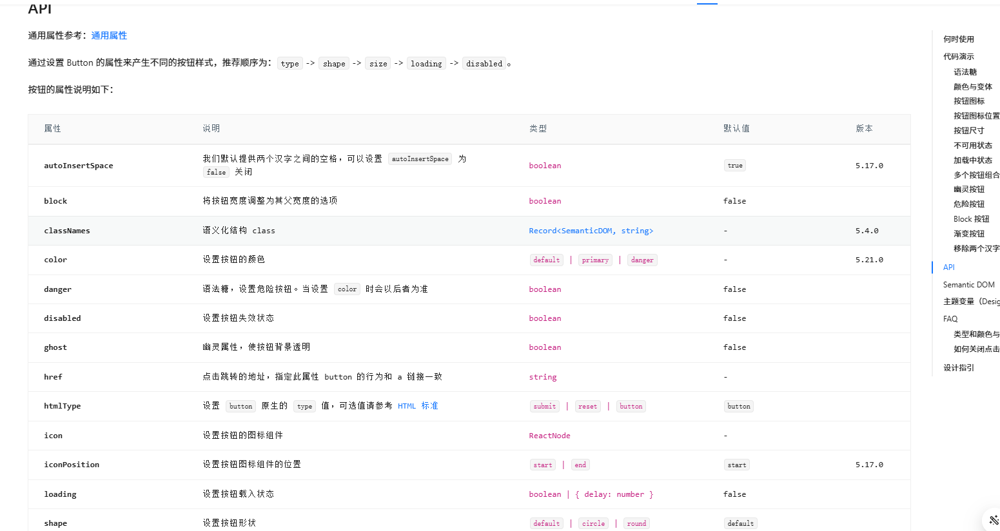
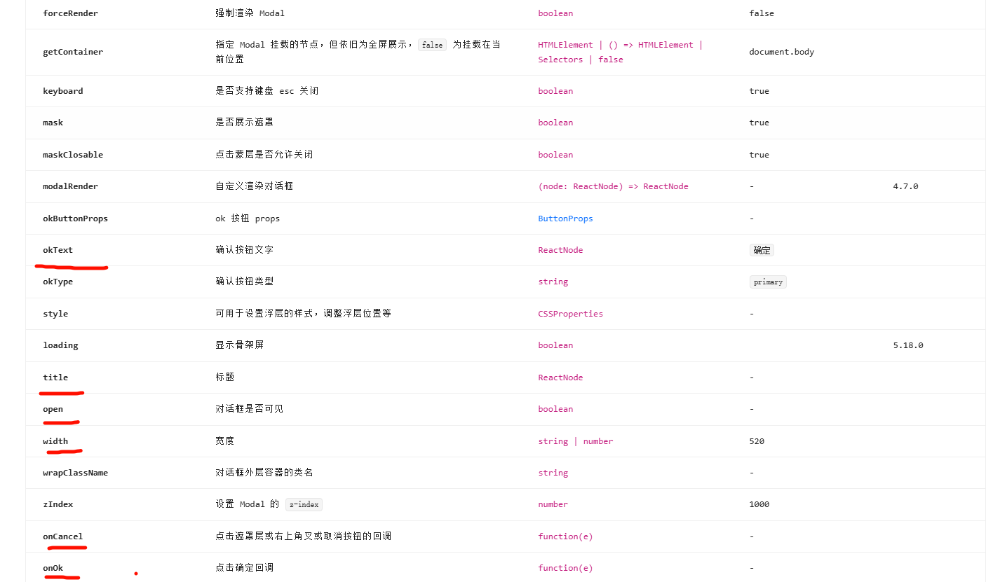

我们知道，像 `react` 和 `vue` 这种框架都是组件化开发。组件的意思是可以重复使用，减少重复开发。但是，如果一个项目从 0 开始全部实现一遍，需要开发特别多代码，而且很多组件没有任何重复开发的意义。例如，表格组件和弹窗组件，这些都是拥有极高重复性的组件。

在 `vue` 里的组件库代表是饿了么的 `element ui`。

在 `react` 里的组件库代表是阿里开发的 `antd`。

官方文档: [https://ant-design.antgroup.com/components/button-cn](https://ant-design.antgroup.com/components/button-cn)

组件库的用法本质上是大差不差的,vue 里,怎么样,react 里就怎么样

首先我们跟着文档进行一次安装,学会如何看文档也是一种技能

像这个页面,一般来说,我们首先是看这个页面,这个页面给我们描述了这个组件的特点,兼容性,以及,如何安装
[https://ant-design.antgroup.com/docs/react/introduce-cn](https://ant-design.antgroup.com/docs/react/introduce-cn)

来到这个安装的步骤[https://ant-design.antgroup.com/docs/react/introduce-cn#%E5%AE%89%E8%A3%85](https://ant-design.antgroup.com/docs/react/introduce-cn#%E5%AE%89%E8%A3%85)

让我们使用 `npm install antd --save`

我们在项目目录下执行这个命令

安装完后,我们可以在回到之前的 app.tsx


我们在这里写`<Bu` 的时候,可以看到编辑器给了我们提示,可以看到这个名称是大写的,代表这个是一个组件,在 Button 最后,写着`antd` 表示这个`Button` 组件是 antd 组件库的,选中这个,回车 ,就会自动引入包,回到页面就可以看到我们的内容

```tsx
import { Button } from "antd";

function App() {
  return (
    <div>
      <Button>这是antd的按钮</Button>
    </div>
  );
}

export default App;
```

## 组件库文档

学组件库不在于需要把全部内容都学一遍,而是在于如何去查看官方文档

这个是按钮的文档
[https://ant-design.antgroup.com/components/button-cn](https://ant-design.antgroup.com/components/button-cn)

可以看到有非常多的样式可以供我们设置,
如果我们需要查看代码点击这个 即可


可以看到文档是,可以通过设置 type 值,来改变按钮的样式,


可以把按钮的官方给的几个案例都写下,主要是熟悉组件库的写法,

在最下面 有一个表格,这个表格给了按钮可以传入的 props 的值,以及他的作用,类型,以及默认值



## 按钮loading
按钮组件里有一个`loading`,的 props,当`loading={true}` 的时候,按钮会出现转圈,这个可以用在用户提交信息的时候,防止用户重复点击

我们来简单模拟一个场景

```tsx
import { Button } from "antd";
import { useState } from "react";

function App() {
  const [value, setValue] = useState("");

  const submit = async () => {
    console.log(value);
  };

  return (
    <div>
      <div>
        <input type="text" onChange={(e) => setValue(e.target.value)} />
      </div>
      <div>
        <Button type="primary" onClick={submit}>
          提交数据
        </Button>
      </div>
    </div>
  );
}

export default App;
```

当我们在输入框输入完内容后,点击按钮,就会打印我们的 value 值,但是,这个按钮,我们可以无限次点击,`submit` 函数就会执行很多次,在实际开发中,我们会在`submit` 函数中调用接口,给后端发送数据,请求的时候,难免会存在网络延迟等情况,我们要避免这种用户重复提交的问题

为此,antd 的按钮就给了一个`loading`的 props 提供给我们

```tsx
import { Button } from "antd";
import { useState } from "react";

function App() {
  const [value, setValue] = useState("");
  // 创建一个loading的useState变量 // [!code focus]
  const [loading, setLoading] = useState(false); // [!code focus]

  const submit = async () => {
    //当用户点击后,设置loading为true // [!code focus]
    setLoading(true); // [!code focus]
    console.log(value);
  };

  return (
    <div>
      <div>
        <input type="text" onChange={(e) => setValue(e.target.value)} />
      </div>
      <div>
        <Button type="primary" loading={loading} onClick={submit}>// [!code focus]
        提交数据
        </Button>
      </div>
    </div>
  );
}

export default App;
```

当我们点击按钮后,按钮就不能再次点击了,就一直处于加载中,我们会在请求结束的时候,来使loading 为false 停止加载

这里由于我们没有安装`axios`,我们安装一次 在控制台打开,输入
```shell
npm i axios
```
安装好了后,我们在`submit` 函数里调用这里提前准备好的接口 这个接口的延迟有2s,2s后才会返回数据
https://apifoxmock.com/m1/5204577-4870723-default/loading


```tsx
import { Button } from 'antd'
import axios from 'axios'
import { useState } from 'react'

function App() {

  const [value,setValue] =  useState("")
  // 创建一个loading的useState变量
  const [loading,setLoading] =  useState(false)


  const submit = async () => {
    //当用户点击后,设置loading为true
    setLoading(true)
    // 在这里请求接口,注意这里{value} 是一个省略的语法 原样式是 {value:value} 当key和value的名称相同的时候可以省略value // [!code focus]
    const result = await axios.post("https://apifoxmock.com/m1/5204577-4870723-default/loading",{value})  // [!code focus]
    console.log(result.data) // [!code focus]
    //请求结束后,设置loading为false
    setLoading(false)  // [!code focus]
  }

  return (
    <div>
      <div><input type="text" onChange={e=>setValue(e.target.value)} /></div>
      <div>
        <Button type="primary" loading={loading} onClick={submit}>提交数据</Button>
      </div>
    </div>
  )
}

export default App

```

但是这样还不太好,万一,后端接口报错了怎么办,所以我们需要用try catch 来捕获异常,然后在final 再设置我们的`setLoading(false)`
```tsx
import { Button } from "antd";
import axios from "axios";
import { useState } from "react";

function App() {
  const [value, setValue] = useState("");
  // 创建一个loading的useState变量
  const [loading, setLoading] = useState(false);

  const submit = async () => {
    try {
      //当用户点击后,设置loading为true
      setLoading(true);
      const result = await axios.post(
        "https://apifoxmock.com/m1/5204577-4870723-default/loading",
        { value }
      );
      console.log(result.data);
      //请求结束后,设置loading为false
      setLoading(false);
    } catch (e) {
      console.log(e);
    } finally {
      //不管请求成功还是失败,最终都要设置loading为false
      setLoading(false)
    }
  };

  return (
    <div>
      <div>
        <input type="text" onChange={(e) => setValue(e.target.value)} />
      </div>
      <div>
        <Button type="primary" loading={loading} onClick={submit}>
          提交数据
        </Button>
      </div>
    </div>
  );
}

export default App;


```

记住我们需要在 finally 里最终保证我们的 loading 一定是可以恢复成false的即可


## AutoButton

讲到这里,我们可以顺便,可以再封装下这个按钮,

你可以看到,这里我们只有一个按钮,会提交数据,在真实项目里,存在大量的按钮会提交数据,如果是这样,那么,我们需要在每个接口请求的地方,都加上 上述的try catch

以及`setLoading(true);`和 `setLoading(false)` ,写1,2个还好,如果写大量这种重复的,就会感觉非常的繁琐,
因为这些loading 其实和我们业务没有关系,在`submit` 函数中,其实我们只是做了这么请求接口这么一件重要的事,其他的`setLoading` 都是有点多余,那么我们可以基于antd的按钮,封装一个可以用于请求接口后,就自动进入loading 状态,如果请求结束,那么就恢复


我们可以把 `setLoading(true);`和 `setLoading(false)` 放在一个通用的组件里

这个组件的名字我们叫`AutoButton` ,在项目根目录下的 `components` 文件夹里创建一个 `AutoButton` 的组件,注意,要先创建`AutoButton` 文件夹,然后再创建`index.tsx`

```tsx

import { Button } from "antd";
import { useState } from "react";

// 声明这个按钮组件的props 类型,方便使用者传入正确的类型
type AutoButtonProps = {
    // 这里表示 onClick 是一个可选的传入函数,所以,函数名称后面会跟上问号,
    //函数的返回值是一个  Promise ,这个的意思就是说 onClick 是一个异步函数, Promise<void> 表示这个异步的没有返回值
  onClick?: () => Promise<void>;
  // children 表示这个组件的内部的中间内容是 一个 react的节点类型,这个可以理解为jsx代码块, children 就是一个任意的 jsx 内容
  children: React.ReactNode;
};

const AutoButton = (props: AutoButtonProps) => {
  const { onClick, children } = props;
    // 创建一个loading 的变量
  const [loading, setLoading] = useState(false);

    // 按钮的点击事件
  const handleClick = async () => {
    try {
      setLoading(true); //设置按钮为加载中
      // 这里 我们使用await 语法,等待 外部传入的onClick 函数执行完毕,
      //这里由于,我们的onClick 是可选传入的参数,所以如果我们不传入的直接调用onClick() 就会出现错误,
      //为了避免这种情况,必须要加上 ? 问号,代表,如果onClick 存在,则执行onClick()
      await onClick?.();
    } catch (e) {
      console.log(e);
    } finally {
      setLoading(false);
    }
  };

    // 这里可以看到 其实children 就是我们之前写的按钮上面的文字,只不过,这个文字是一个jsx可以是任意的东西
  return (
    <Button onClick={handleClick} loading={loading}>
      {children}
    </Button>
  );
};

export default AutoButton;


```


在上面的代码中用到了一个可选的函数调用,在ts中,如果某个函数是可选的,如果你直接写`onClick()` ts是会给你报错了,因为,这个函数可能不存在,所以,对于不存在的函数,必须使用问号可选链的语法

问号可选链,其实是一个简写的语法,如果换成我们熟悉的if判断,则是以下代码

```ts
if(onClick){
  onClick()
}
```
问号语法函数调用等同于以上代码,当`onClick`存在,则调用`onClick()`


回到我们最开始的`app.tsx`文件,我们引入我们的`AutoButton` 组件,当前`AutoButton` 被点击的时候,触发一个`autoSubmit` 的函数去请求接口
```tsx
import { Button } from "antd";
import axios from "axios";
import { useState } from "react";
import AutoButton from "./components/AutoButton"; // [!code focus]

function App() {
  const [value, setValue] = useState("");
  // 创建一个loading的useState变量
  const [loading, setLoading] = useState(false);

  const submit = async () => {
    try {
      //当用户点击后,设置loading为true
      setLoading(true);
      const result = await axios.post(
        "https://apifoxmock.com/m1/5204577-4870723-default/loading",
        { value }
      );
      console.log(result.data);
      //请求结束后,设置loading为false
      setLoading(false);
    } catch (e) {
      console.log(e);
    } finally {
      //不管请求成功还是失败,最终都要设置loading为false
      setLoading(false)
    }
  };

  const autoSubmit = async () => {// [!code focus]
    // 这里我们没有做其他事情,只是把上面的请求接口代码复制了下来   // [!code focus]
    const result = await axios.post("https://apifoxmock.com/m1/5204577-4870723-default/loading",{ value }); // [!code focus]
    console.log(result.data); // [!code focus]
  } // [!code focus]

  return (
    <div>
      <div>
        <input type="text" onChange={(e) => setValue(e.target.value)} />
      </div>
      <div>
        <Button type="primary" loading={loading} onClick={submit}>
          提交数据
        </Button>
        <AutoButton  onClick={autoSubmit}> // [!code focus]
          提交数据 // [!code focus]
        </AutoButton> // [!code focus]
      </div>
    </div>
  );
}

export default App;


```

可以看到,我们的我们的 `AutoButton` 的`onClick` 事件,只关心数据请求,并不关心是否`loading`,因为loading的状态全部都在 `AutoButton` 这个组件内部,这样一来,我们可以把`Button`
全部替换成我们组件封装的`AutoButton`

## message组件

官方文档
[https://ant-design.antgroup.com/components/message-cn](https://ant-design.antgroup.com/components/message-cn)

message 主要是用来提示信息,可以弹出一些提示,例如用户提交数据成功后,可以提示下`请求成功`

文档推荐使用 ` const [messageApi, contextHolder] = message.useMessage();`
这种方式,但是我们一般为了图方便都是使用 静态的方法,`https://ant-design.antgroup.com/components/message-cn#api`
例如`message.success()`  `message.error` `message.info` 等等

我们可以在上面的代码基础上添加 这种静态的方法调用,
```tsx
import { Button, message } from "antd"; // [!code focus]
import axios from "axios";
import { useState } from "react";
import AutoButton from "./components/AutoButton";

function App() {
  const [value, setValue] = useState("");
  // 创建一个loading的useState变量
  const [loading, setLoading] = useState(false);

  const submit = async () => {
    try {
      //当用户点击后,设置loading为true
      setLoading(true);
      const result = await axios.post(
        "https://apifoxmock.com/m1/5204577-4870723-default/loading",
        { value }
      );
      console.log(result.data);
      //请求结束后,设置loading为false
      setLoading(false);
    } catch (e) {
      console.log(e);
    } finally {
      //不管请求成功还是失败,最终都要设置loading为false
      setLoading(false)
    }
  };

  const autoSubmit = async () => {
    const result = await axios.post(
      "https://apifoxmock.com/m1/5204577-4870723-default/loading",
      { value }
    );
    console.log(result.data);
    message.success("提交成功"); // [!code focus]
  }

  return (
    <div>
      <div>
        <input type="text" onChange={(e) => setValue(e.target.value)} />
      </div>
      <div>
        <Button type="primary" loading={loading} onClick={submit}>
          提交数据
        </Button>
        <AutoButton  onClick={autoSubmit}>
          提交数据
        </AutoButton>
      </div>
    </div>
  );
}

export default App;


```

## modal 弹窗
文档地址[https://ant-design.antgroup.com/components/modal-cn](https://ant-design.antgroup.com/components/modal-cn)

当我们点击按钮的时候,就可以弹出一个弹窗,算是,非常多场景使用的

创建一个`ModalPage` 的页面

学组件库的最佳方式,就是copy 官网的代码,我们直接复制第一个的代码

```tsx

import { Button, Modal } from "antd";
import { useState } from "react";

const ModalPage = () => {
  // 用一个布尔类型来控制是否弹出弹窗
  const [isModalOpen, setIsModalOpen] = useState(false);

  // 展示弹窗
  const showModal = () => {
    setIsModalOpen(true);
  };

  //点击弹窗内部的自带的ok按钮
  const handleOk = () => {
    setIsModalOpen(false);
  };

  // 点击取消按钮
  const handleCancel = () => {
    setIsModalOpen(false);
  };

  return (
    <>
      <Button type="primary" onClick={showModal}>
        Open Modal
      </Button>
      <Modal
        title="Basic Modal"
        open={isModalOpen} // 这里的open 就是表示这个弹窗是否弹出,
        onOk={handleOk}
        onCancel={handleCancel}
      >
        <p>Some contents...</p>
        <p>Some contents...</p>
        <p>Some contents...</p>
        <p>我们可以在弹窗写任意内容</p>
      </Modal>
    </>
  );
};

export default ModalPage;

```
非常简单的写法,这也是最基本的用法,但是最基本的用法也是最常用的场景,接下来主要是了解下,这个弹窗可以设置哪些props 比较重要

往下滑动,可以看到 `api` 表格,有非常多属性,当我们需要调整弹窗的配置的时候,就来这个表格查询就可以了

例如,弹窗内部的按钮是自带,我们可以选择不展示这个按钮,或者,更换按钮的文字


可以看到这里,如果我们把`footer` 设置为null,则不会展示底部的按钮



这里标注的几个属性是最常用的,建议把这个属性都敲一遍,感受下是干嘛的


最后说明下这个弹窗`Modal` 组件在页面中写的位置

上面我是放在最后的,但是其实,这个`Modal` 放在那个`div`下面 一点也不重要,一般是放在最后就可以了,

## 表单 组件

antd 有一套自己的表单组件,而且必须按照他的规范来写才行


文档[https://ant-design.antgroup.com/components/form-cn](https://ant-design.antgroup.com/components/form-cn)

还是老规矩,复制官方的第一个案例下来,到自己的组件中

```tsx
import React from "react";
import type { FormProps } from "antd";
import { Button, Checkbox, Form, Input } from "antd";

type FieldType = {
  username?: string;
  password?: string;
  remember?: string;
};

const FormPage = () => {
  const onFinish: FormProps<FieldType>["onFinish"] = (values) => {
    console.log("Success:", values);
  };

  const onFinishFailed: FormProps<FieldType>["onFinishFailed"] = (
    errorInfo
  ) => {
    console.log("Failed:", errorInfo);
  };
  return (
    <Form
      name="basic"
      labelCol={{ span: 8 }}
      wrapperCol={{ span: 16 }}
      style={{ maxWidth: 600 }}
      initialValues={{ remember: true }}
      onFinish={onFinish}
      onFinishFailed={onFinishFailed}
      autoComplete="off"
    >
      <Form.Item<FieldType>
        label="Username"
        name="username"
        rules={[{ required: true, message: "Please input your username!" }]}
      >
        <Input />
      </Form.Item>

      <Form.Item<FieldType>
        label="Password"
        name="password"
        rules={[{ required: true, message: "Please input your password!" }]}
      >
        <Input.Password />
      </Form.Item>

      <Form.Item<FieldType>
        name="remember"
        valuePropName="checked"
        wrapperCol={{ offset: 8, span: 16 }}
      >
        <Checkbox>Remember me</Checkbox>
      </Form.Item>

      <Form.Item wrapperCol={{ offset: 8, span: 16 }}>
        <Button type="primary" htmlType="submit">
          Submit
        </Button>
      </Form.Item>
    </Form>
  );
};

export default FormPage;

```
这里可以看到他其实,嵌套了非常多层,其中最外层的 为`Form` 组件,在 `Form` 内写`Form.Item` 组件

其中,每个`Form.Item` 都是一行输入框

`Form` 中的 `name` 值,意义不是很大,主要关心 以下 属性

`initialValues` 用于设置默认值.或者用来数据回显的

`onFinish` 当表单全部校验通过后,触发的一个事件,触发到这个事件其实就代表,数据已经填写正确了,可以提交给后端了

`onFinishFailed` 表示数据填写出现异常,例如,表单校验未通过


之后来到 `Form.Item`其中

`label` 表示输入框左侧的文字是什么

`name` 表示数据存的key的名字  最终 我们得到的数据就是 `{name:"zs"}`,如果是`age`则为`{age:123}`

`rules` 这个是这个输入框的校验事件,具体可以看下文档  [Form.Item的属性说明](https://ant-design.antgroup.com/components/form-cn#formitem)


最后只剩下 `<Input />` 我们的输入框,可以看到,这里没有绑定任何的事件,也没有 写`onChange`,我们知道,input 变化会触发`onChange` 事件,这里没有写是因为antd 底层帮我们去获取了
这个输入框的 `onChange` 事件,并且自动存入`Form` 组件中,所以,我们不用关心,如何存,存储在哪的问题,简化的我们的重复代码.所以,如果我们想写一个表单的时候,我们不需要给这给输入框添加任何事件,antd会自动监听这个事件的变化,我们只需要全程关心`onFinish` 事件传递过来的值就可以了


尝试,把这个 表单写入到 我们之前的弹窗中,因为,在实际项目中,我们的弹窗中都是写表单内容


这里其实可以看到,我们这个组件 只是一个弹窗,和表单,如果要把这么多代码都写在页面的那个组件里面,未免有点太多了,所以,我们可以把 表单和弹窗所的内容,单独写一个组件,到时候,我们只需要在页面组件中引入这个我们封装号好的组件即可,
```tsx
import { Button, Checkbox, Form, FormProps, Input, Modal } from "antd";
import { useState } from "react";

type FieldType = {
    username?: string;
    password?: string;
    remember?: string;
  };
const ModalPage = () => {
  const [isModalOpen, setIsModalOpen] = useState(false);

  const showModal = () => {
    setIsModalOpen(true);
  };

  const handleOk = () => {
    setIsModalOpen(false);
  };

  const handleCancel = () => {
    setIsModalOpen(false);
  };


  const onFinish: FormProps<FieldType>["onFinish"] = (values) => {
    console.log("Success:", values);
  };

  const onFinishFailed: FormProps<FieldType>["onFinishFailed"] = (
    errorInfo
  ) => {
    console.log("Failed:", errorInfo);
  };

  return (
    <>
      <Button type="primary" onClick={showModal}>
        Open Modal
      </Button>
      <Modal
        title="Basic Modal"
        open={isModalOpen}
        onOk={handleOk}
        onCancel={handleCancel}
      >
        <Form
          name="basic"
          labelCol={{ span: 8 }}
          wrapperCol={{ span: 16 }}
          style={{ maxWidth: 600 }}
          initialValues={{ remember: true }}
          onFinish={onFinish}
          onFinishFailed={onFinishFailed}
          autoComplete="off"
        >
          <Form.Item<FieldType>
            label="Username"
            name="username"
            rules={[{ required: true, message: "Please input your username!" }]}
          >
            <Input />
          </Form.Item>

          <Form.Item<FieldType>
            label="Password"
            name="password"
            rules={[{ required: true, message: "Please input your password!" }]}
          >
            <Input.Password />
          </Form.Item>

          <Form.Item<FieldType>
            name="remember"
            valuePropName="checked"
            wrapperCol={{ offset: 8, span: 16 }}
          >
            <Checkbox>Remember me</Checkbox>
          </Form.Item>

          <Form.Item wrapperCol={{ offset: 8, span: 16 }}>
            <Button type="primary" htmlType="submit">
              Submit
            </Button>
          </Form.Item>
        </Form>
      </Modal>
    </>
  );
};

export default ModalPage;


```


写组件的方法,,通常是需要先把jsx 代码写出来,然后思考下,这个组件需要传入哪写props

例如上面这个例子,我们需要把 open, 是否显示弹窗当成props ,这样页面才能控制他是否弹出,

我们还需要把表单的提交事件当成一个props 来传入,让页面传入 表单的 `onFinish` 事件

```tsx
import { Button, Checkbox, Form, Input, Modal } from "antd";

type Props = {
  isModalOpen: boolean;
  onFinish: () => void;
  onFinishFailed: () => void;
};

type FieldType = {
  username?: string;
  password?: string;
  remember?: string;
};

const ModalForm = (props: Props) => {
  const { isModalOpen, onFinish, onFinishFailed } = props;

  const handleOk = () => {
    console.log("ok");
  };

  const handleCancel = () => {
    console.log("cancel");
  };

  return (
    <Modal
      title="Basic Modal"
      open={isModalOpen}
      onOk={handleOk}
      onCancel={handleCancel}
    >
      <Form
        name="basic"
        labelCol={{ span: 8 }}
        wrapperCol={{ span: 16 }}
        style={{ maxWidth: 600 }}
        initialValues={{ remember: true }}
        onFinish={onFinish}
        onFinishFailed={onFinishFailed}
        autoComplete="off"
      >
        <Form.Item<FieldType>
          label="Username"
          name="username"
          rules={[{ required: true, message: "Please input your username!" }]}
        >
          <Input />
        </Form.Item>

        <Form.Item<FieldType>
          label="Password"
          name="password"
          rules={[{ required: true, message: "Please input your password!" }]}
        >
          <Input.Password />
        </Form.Item>

        <Form.Item<FieldType>
          name="remember"
          valuePropName="checked"
          wrapperCol={{ offset: 8, span: 16 }}
        >
          <Checkbox>Remember me</Checkbox>
        </Form.Item>

        <Form.Item wrapperCol={{ offset: 8, span: 16 }}>
          <Button type="primary" htmlType="submit">
            Submit
          </Button>
        </Form.Item>
      </Form>
    </Modal>
  );
};

export default ModalForm;

```

通过这样封装,我们就可以在页面中不用展示很长的代码块了,而且也算是拆分出去了,可以更方便的去修改我们拆分出去的代码,不必在当前页面中写,不然可能会经常代码冲突和同事,我们只需要在页面引入这个组件,并且传入相应的函数即可

## 表格的使用
文档地址 [https://ant-design.antgroup.com/components/table-cn](https://ant-design.antgroup.com/components/table-cn)


antd表格 最开始就给了一个最简单的实例
```tsx
const dataSource = [
  {
    key: '1',
    name: '胡彦斌',
    age: 32,
    address: '西湖区湖底公园1号',
  },
  {
    key: '2',
    name: '胡彦祖',
    age: 42,
    address: '西湖区湖底公园1号',
  },
];

const columns = [
  {
    title: '姓名',
    dataIndex: 'name',
    key: 'name',
  },
  {
    title: '年龄',
    dataIndex: 'age',
    key: 'age',
  },
  {
    title: '住址',
    dataIndex: 'address',
    key: 'address',
  },
];

<Table dataSource={dataSource} columns={columns} />;
```
然后我们创建一个新的页面 `tablePage`

```tsx
// 注意要引入 Table
import { Table } from "antd";

const TablePage = () => {
  const dataSource = [
    {
      key: "1",
      name: "胡彦斌",
      age: 32,
      address: "西湖区湖底公园1号",
    },
    {
      key: "2",
      name: "胡彦祖",
      age: 42,
      address: "西湖区湖底公园1号",
    },
  ];

  const columns = [
    {
      title: "姓名",
      dataIndex: "name",
      key: "name",
    },
    {
      title: "年龄",
      dataIndex: "age",
      key: "age",
    },
    {
      title: "住址",
      dataIndex: "address",
      key: "address",
    },
  ];
  return (
    <div>
      <Table dataSource={dataSource} columns={columns} />;
    </div>
  );
};
export default TablePage;

```

dataSource

表示数据源,也就是表格的数据,这个是一个数组,数组中的每个对象表示每一行的数据,其中有一个数据比较特殊,`key`,这个是保证数据的唯一性,是一个固定的名称

columns

其中 `columns` 是一个数组,表示表格的每一列的配置
title: 列的名称,用来展示在页面上面的名称
dataIndex: 对于列数据使用的变量名称,也就是`dataSource` 中的 对象的`key`值

例如 `名字` 这一列,他的`dataIndex` 为 `name`,表示这一列读取的 `dataSource` 中的对象的名称叫 `name` ,如果匹配上了,就能正确的显示出来


但是这样的表格只能渲染后端返回的数据,没有操作的按钮,如果我们需要操作按钮,则需要我们使用`antd` 的`render` 属性来自定义渲染,
```tsx
import React from 'react';
import { Space, Table, Tag } from 'antd';
import type { TableProps } from 'antd';

interface DataType {
  key: string;
  name: string;
  age: number;
  address: string;
  tags: string[];
}

const columns: TableProps<DataType>['columns'] = [
  {
    title: 'Name',
    dataIndex: 'name',
    key: 'name',
    render: (text) => <a>{text}</a>,
  },
  {
    title: 'Age',
    dataIndex: 'age',
    key: 'age',
  },
  {
    title: 'Address',
    dataIndex: 'address',
    key: 'address',
  },
  {
    title: 'Tags',
    key: 'tags',
    dataIndex: 'tags',
    render: (_, { tags }) => (
      <>
        {tags.map((tag) => {
          let color = tag.length > 5 ? 'geekblue' : 'green';
          if (tag === 'loser') {
            color = 'volcano';
          }
          return (
            <Tag color={color} key={tag}>
              {tag.toUpperCase()}
            </Tag>
          );
        })}
      </>
    ),
  },
  {
    title: 'Action',
    key: 'action',
    render: (_, record) => (
      <Space size="middle">
        <a>Invite {record.name}</a>
        <a>Delete</a>
      </Space>
    ),
  },
];

const data: DataType[] = [
  {
    key: '1',
    name: 'John Brown',
    age: 32,
    address: 'New York No. 1 Lake Park',
    tags: ['nice', 'developer'],
  },
  {
    key: '2',
    name: 'Jim Green',
    age: 42,
    address: 'London No. 1 Lake Park',
    tags: ['loser'],
  },
  {
    key: '3',
    name: 'Joe Black',
    age: 32,
    address: 'Sydney No. 1 Lake Park',
    tags: ['cool', 'teacher'],
  },
];

const App = () => <Table<DataType> columns={columns} dataSource={data} />;

export default App;

```
这个是官网给的第二个案例,他提供了按钮的的自定义渲染,并且给表格的数据添加了泛型的支持,不必在意为什么这里的泛型是这样,我们开发的时候需要关注他是怎么写的就行了

其中 对于name 这一列 是这样的`render: (text) => <a>{text}</a>,`
`render` 是一个属性,他的值是一个函数,这个函数 需要返回一个任意jsx 代码,函数返回的jsx 代码,最终就会渲染在 `name` 这一列,
函数参数,如只有一个参数的时候,表示,每行的这列的对于的name的值,你可以在这里打一个断点调试,记住,这里不能只能写`debugger`,必须要用大括号包裹起来

```tsx
render: (text) => {
  debugger
  return <a>{text}</a>
},
```
这样才能进行断点调试,这样就可以看到text 是什么值了


`render` 还可以写3种参数的形式,
`function(text, record, index) {}	`

`text`:表示 当前列的,当前行的值 ,

`record`: 表示这一行的所有列的值

`index`: 就是下标,所以我们写函数的时候,这里的参数可以写一个,也可以写2个,具体看我们需要用什么

总之 `render` 可以自定义某一个格子的渲染,可以是任意的jsx代码,还可以是一个组件,并且可以在这个函数里拿到这一行的全部数据,


对于 上述表格中一列为 `Action` ,这个名称是自己随便定义的,只要保证,数据源(data) 里没有这个名称的值就可以了
`render: (_, { tags })` 注意,这里`{tags}` 表示解构,从对象中获取出名字叫`tags`的值,这个写法在`props` 里用过

```tsx
// 从props 中获取出名字叫name 和age的值
const { name,age} = props
```


在实际开发中,我们的数据源都是来源于接口,进入页面的时候,调用接口后,获取数据,然后渲染到表格上

我们可以从这里看到
```tsx
 <Table dataSource={dataSource} columns={columns} />;
```

`dataSource` 是从这里传入的,我们就可以通过接口返回的数据,存入 `dataSource` 中,使得表格渲染接口返回的数据


准备了一个curd 的接口文档
https://apifox.com/apidoc/shared-d824d31c-5fb9-4a92-bdaa-4fcd5c0969fd/api-231380064

要学会查看接口文档
