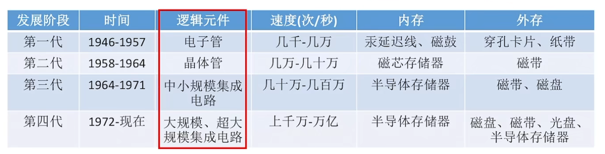
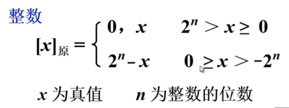
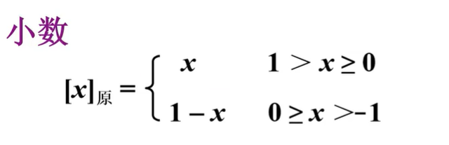
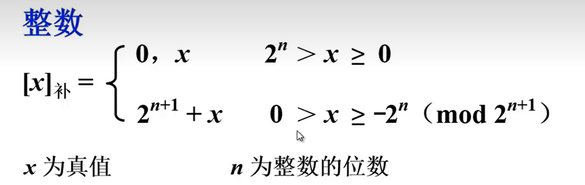
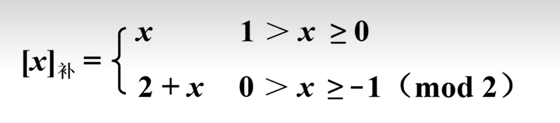
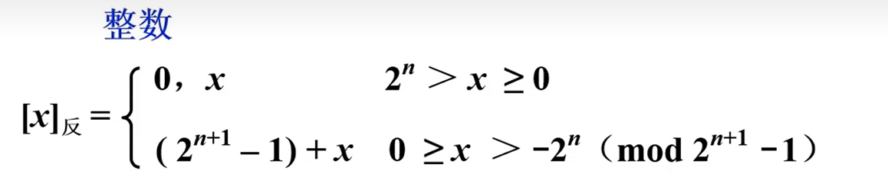
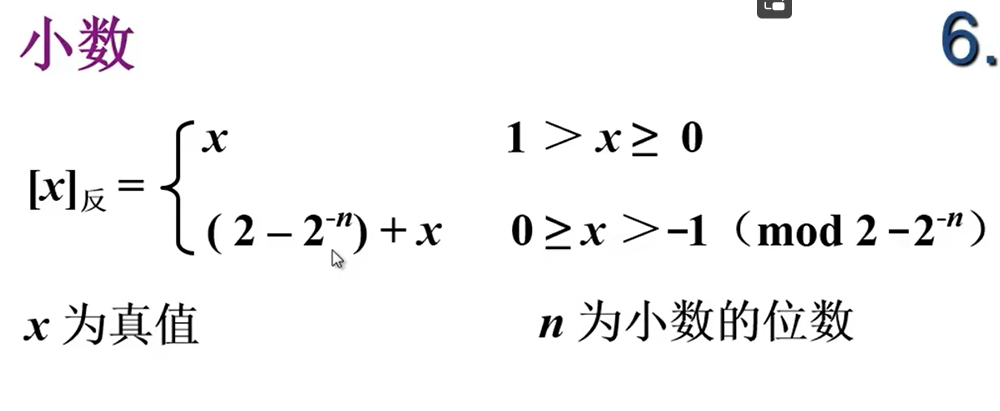
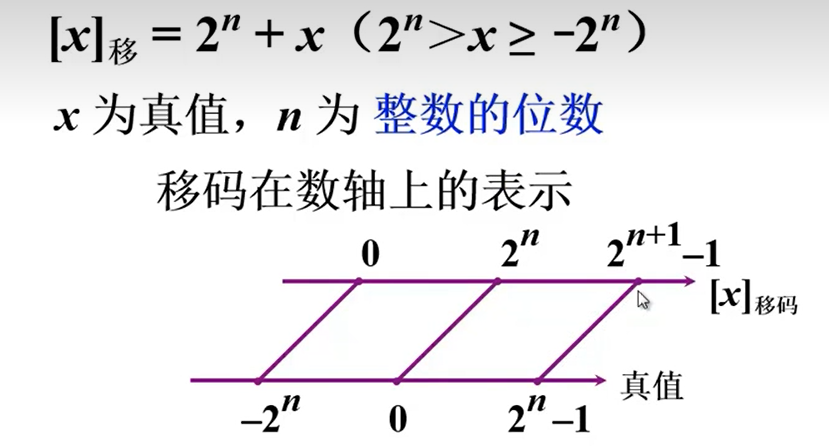
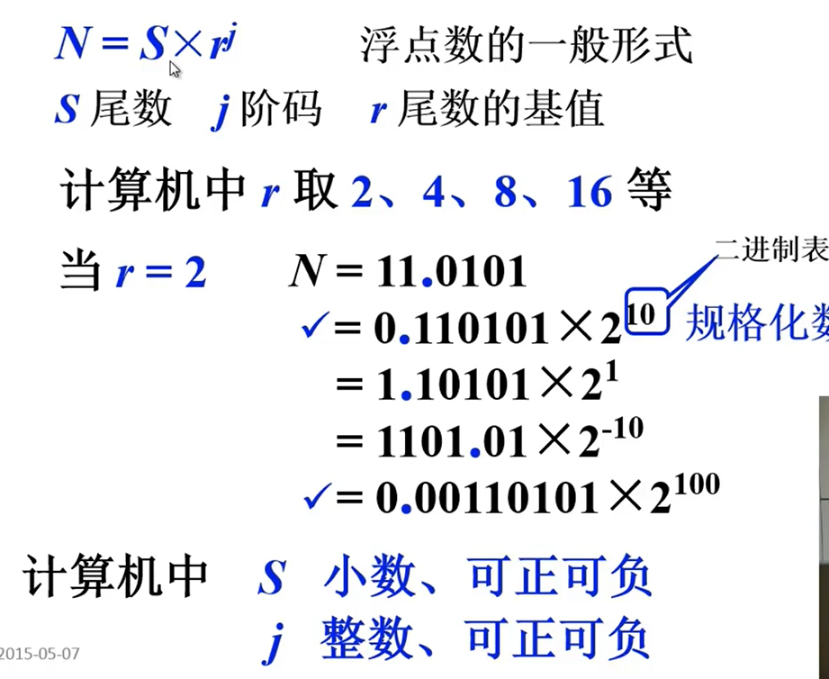

计算机系统是由**硬件**,**软件** 构成的

### 低电平和高电平

在数字电路中,我们通常把 `0-0.25V` 称为低电平

`3.5-5V`称为高电平,

电子电路中,是通过电信号来传递的,`0为低电平`,`1为高电平`

### 第一台电子数字计算机 

ENIAC (1946) 

其逻辑元件为 **电子管**

### 存储程序

将指令以二进制的形式事先输入到计算机的主存储器里,然后按照存储器的的首地址执行第一条指令,之后,依次按照顺序执行其他指令,直到程序执行结束

### 原码表示方法

#### 整数

如真值 `x=+1110` 则 原码为 `0,1110`

:::  tip 提示

逗号是为了把符号位和数值分隔开,原码的第一位为符号位

:::

如真值为`x=-1110`  则原码为 `2^4 +1110=1000+1110=1,1110` 

#### 小数

如`x=+0.1101`  原码则是`0.1101`

原码第一位为符号位

`x=-0.1101`  原码则是`1-(-0.1101)=1.1101` 

1 代表符号位,为负数

### 补码表示法

- 一个负数加上 “模” 即得该负数的补数 
- 两个互为补数的数 它们绝对值之和即为 模 数

#### 整数

如 `x=+1010` 则补码为 `0,1010`

:::  tip 提示

逗号是为了把符号位和数值分隔开,补码的第一位为符号位

:::

**当真值为负时,补码=原码除符号位,求反,末尾+1**

**当真值为负时,原码=补码除符号位,求反,末尾+1**

#### 小数

**当真值为负时,补码=原码除符号位,求反,末尾+1**

**当真值为负时,原码=补码除符号位,求反,末尾+1**

### 反码表示法

#### 整数

#### 小数

### 移码表示法

补码很难直接判断值得大小

所以采用偏移量,将真值 偏移 2^n次方 ( n 代表 整数位数)

> 移码的符号表示和补码相反，1表示正数，0表示负数

### 浮点表示

其中,`0.110101` 和`0.00110101` 是正确在计算机存储的值, 当 为`0.1xxx` 使,这个数为规格化

阶码`(其本质是二进制)`计算方式为 ,小数点向左移动`2`为.则把`2`转换成二进制  `10`

向右移动`2` 位.则为 把`2`转二进制,再添符号 为`-10`

