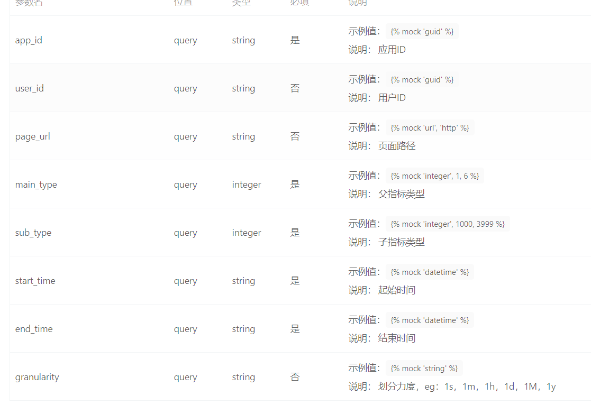
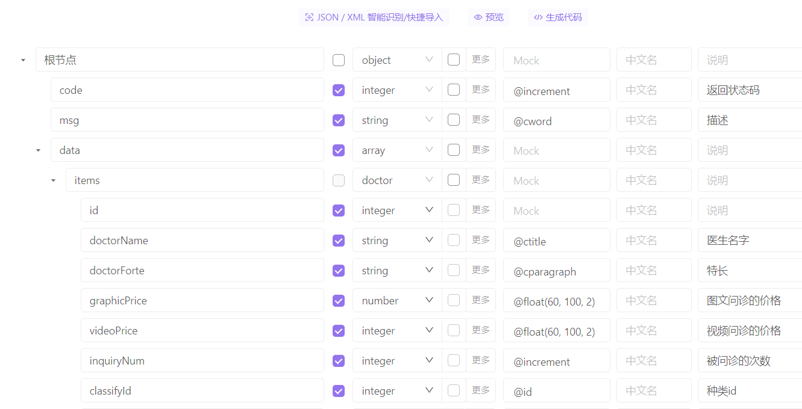
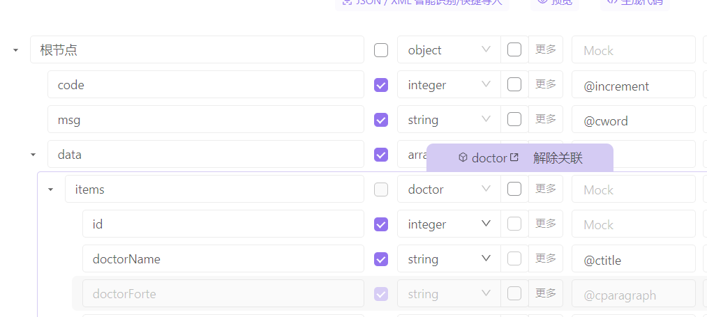
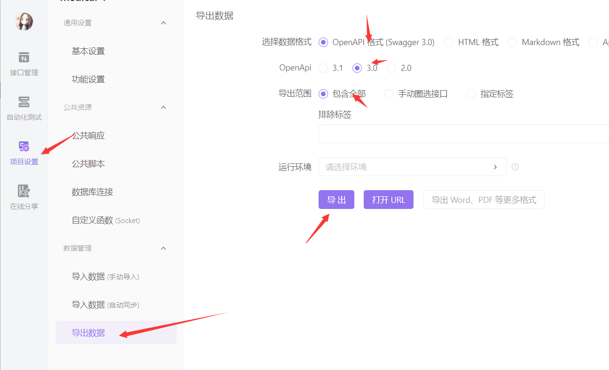

使用 knife4j 生成 出来的类型并不好用,而且随着泛型增加,会生成一大堆重复的

并且配置 Java 配置起来比较繁琐,且复杂,我推荐使用 `apifox `工具

工具不就不介绍如何使用的,重点放在代码生成生成

创建一个接口,设置接口参数,这里可以很方便的设置参数是否是必须的,

然后设置接口返回值

这里有个注意的地方,返回值 code 这种,建议不用使用实体类关联,直接写返回值名称,类型这些即可,但是在 data 类型的时候,最好选择 模型关联 这样方便生成出来的代码有通用的实体类型

比如这样,只有这个 data 是关联了实体类型的,

然后进行上述操作,导出我们的 openapi json 文件

接着就可以进行 文章 2 中的前端搭建 内容 [2.knife4j 文档.md](./2.knife4j%20文档.html#前端代码生成)
